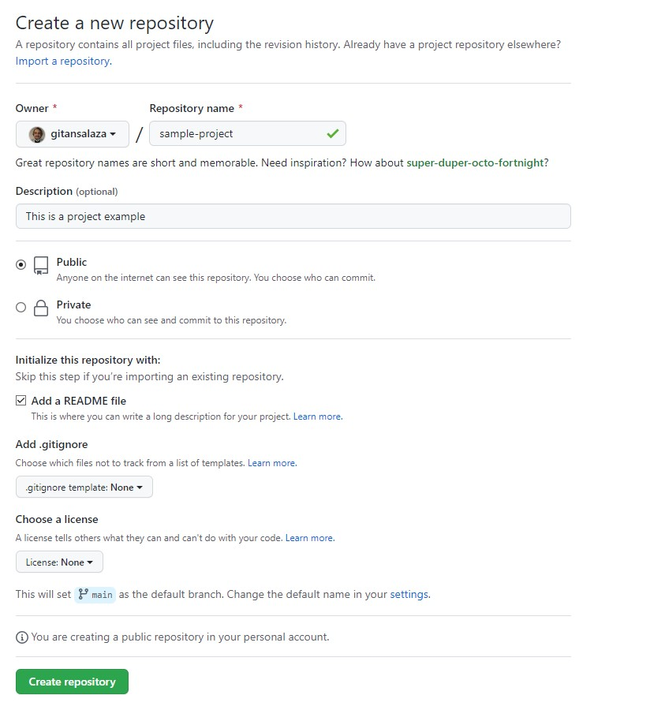
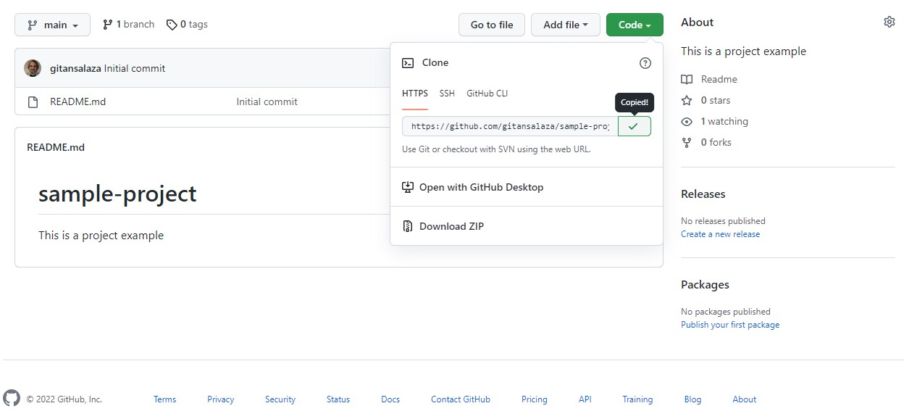
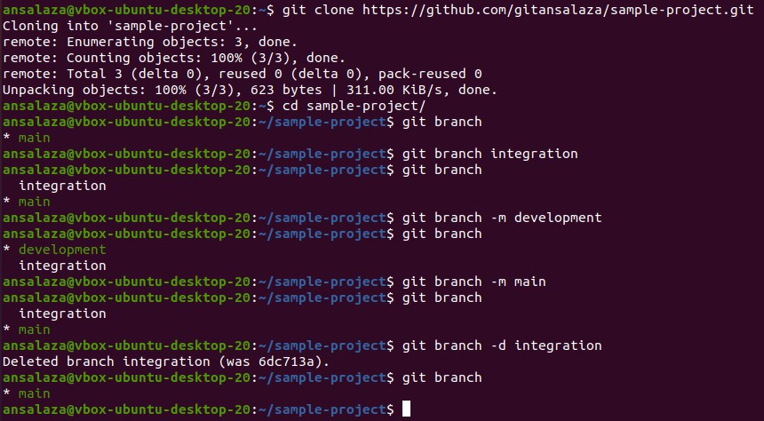

# Practice 2.4.10: Create a Branch in Git

Caltech | _Center for Technology & Management Education_ | Simpl¡Learn <br/>
Post Graduate Program in DevOps <br/>
PG DO - Configuration Management with Ansible and Terraform <br/>

- Assigned to: Antonio Salazar Gomez ([antonio.salazar@ymail.com](mailto:antonio.salazar@ymail.com))
- Updated on:  2022-05-22 
- Github repo: [gitansalaza/devops/course_02/practices/practice_2.4.10.md](https://github.com/gitansalaza/devops/blob/main/course_02/practices/practice_2.4.10.md)

# DESCRIPTION
To create branches in Git

Tools required: Git

**Steps to be followed**:

1. Create a new repository.
2. Clone the GitHub repository.
3. List all the branches in your repository.
4. Create a new branch.
5. Verify the creation of the new branch.
6. Rename an existing branch.
7. Delete the branch.
8. Verify the deletion of the branch.

<br/>

# Solution
## 1. Create a new repository.

  - Click on the Create new button to create a new repository.

   


## 2. Clone the GitHub repository.

  - Copy the HTTPS URL from the GitHub Repository.

   

  - Open a new terminal on your local host and issue:
  >```
  > git clone <HTTPS Repo URL> # Paste here
  >```

## 3. List all the branches in your repository.

  >```
  > git branch
  >```


## 4. Create a new branch.

  >```
  > git branch integration
  >```


## 5. Verify the creation of the new branch.

  >```
  > git branch
  >```


## 6. Rename an existing branch.

  >```
  > git branch -m development
  > git branch
  > git branch -m main
  > git branch
  >```


## 7. Delete the branch.

  >```
  > git branch -d integration
  >```

## 8. Verify the deletion of the branch.

  >```
  > git branch
  >```

## Image example
   


# Log file
[2.4.10.git_create_new_branch.txt](logs/2.4.10.git_create_new_branch.txt) 
