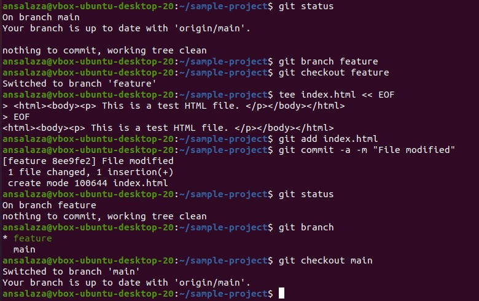

# Practice 4.12: Switching Branches in Git

Caltech | _Center for Technology & Management Education_ | Simpl¡Learn <br/>
Post Graduate Program in DevOps <br/>
PG DO - Configuration Management with Ansible and Terraform <br/>

- Assigned to: Antonio Salazar Gomez ([antonio.salazar@ymail.com](mailto:antonio.salazar@ymail.com))
- Updated on:  2022-05-22 
- Github repo: [gitansalaza/devops/course_02/practices/practice_4.12.md](https://github.com/gitansalaza/devops/blob/main/course_02/practices/practice_4.12.md)

# DESCRIPTION
o switch between branches in Git

**Tools required**: Git

Steps to be followed:

1. Create a new branch.
2. Switch to the new branch.
3. Create a file and commit the changes.
4. Check the status of the new branch.
5. Switch back to the main branch.

<br/>

# Solution
## 1. Create a new branch.
  
  >```
  > git branch feature
  >```

## 2. Switch to the new branch.

  >```
  > git checkout feature
  >```

## 3. Create a file and commit the changes.

  >```
  > tee index.html << EOF
  > <html><body><p> This is a test HTML file. </p></body></html>
  > EOF
  > git add index.html
  > git commit -a -m "File modified"
  >```


## 4. Check the status of the new branch.

  >```
  > git status
  > git branch
  >```

## 5. Switch back to the main branch.

  >```
  > git checkout main
  >```

## Image example
   


# Log file
[4.12.git_switch_between_branches.txt](logs/4.12.git_switch_between_branches.txt) 
