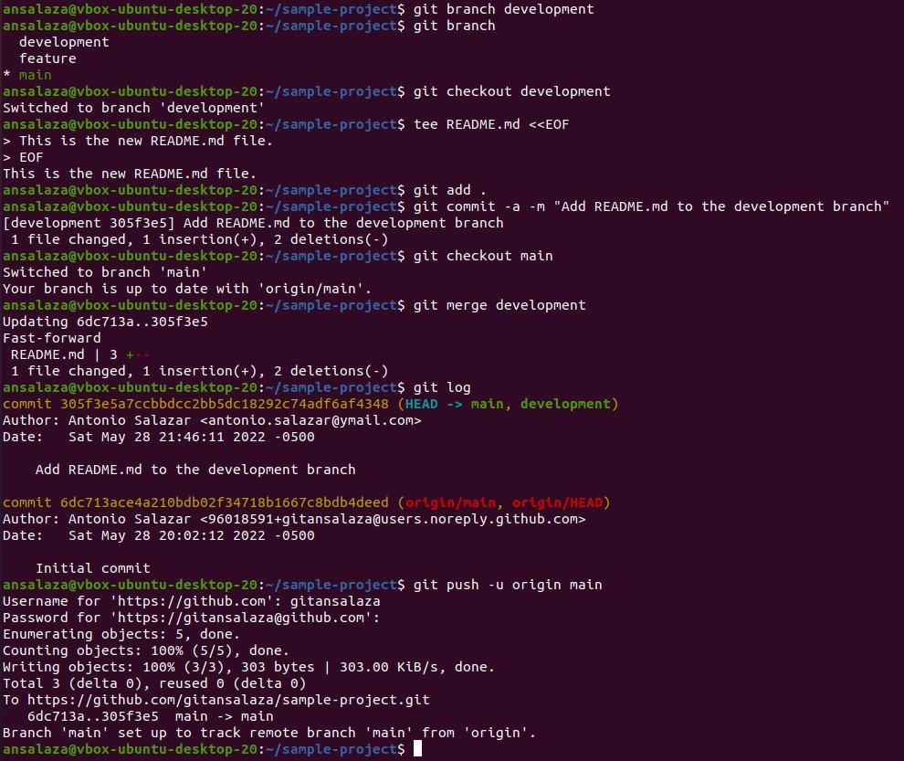

# Practice 4.14: Merging Branches in Git

Caltech | _Center for Technology & Management Education_ | Simpl¡Learn <br/>
Post Graduate Program in DevOps <br/>
PG DO - Configuration Management with Ansible and Terraform <br/>

- Assigned to: Antonio Salazar Gomez ([antonio.salazar@ymail.com](mailto:antonio.salazar@ymail.com))
- Updated on:  2022-05-28 
- Github repo: [gitansalaza/devops/course_02/practices/practice_4.14.md](https://github.com/gitansalaza/devops/blob/main/course_02/practices/practice_4.14.md)

# DESCRIPTION
To merge branches in Git

**Tools required**: Git

Steps to be followed:

1. Create a new branch.
2. Create a new file in the new branch.
3. Switch to the main branch.
4. Merge the branches.
5. Push the changes to the remote repository.


<br/>

# Solution
## 1. Create a new branch.
  
  >```
  > git branch development
  >```

## 2. Create a new file in the new branch.

  >```
  > git checkout development
  > tee README.md <<EOF
  > This is the new README.md file.
  > EOF
  > git add .
  > git commit -a -m "Add README.md to the development branch"
  >```

## 3. Switch to the main branch.

  >```
  > git checkout main
  >```

## 4. Merge the branches.

  >```
  > git merge development
  > git branch
  > 
  >```

## 5. Push the changes to the remote repository.

  >```
  > git log
  > git push -u origin main
  > git log
  >```

## Image example
  

  


# Log file
[4.14.git_merge.txt](logs/4.14.git_merge.txt) 
