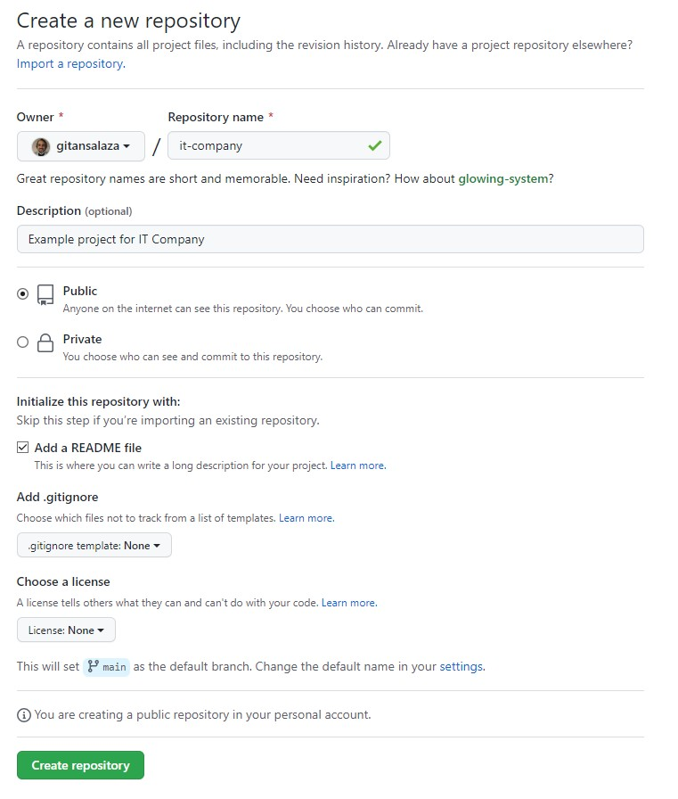
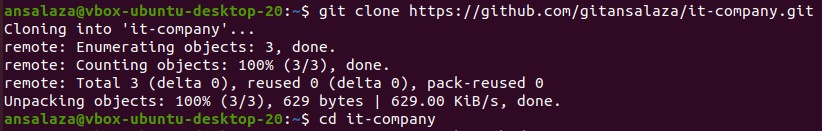
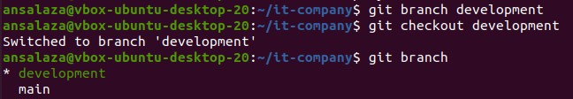
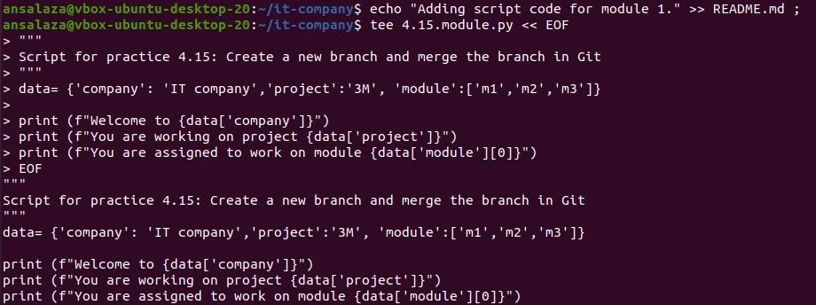
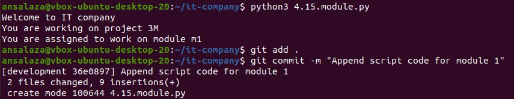
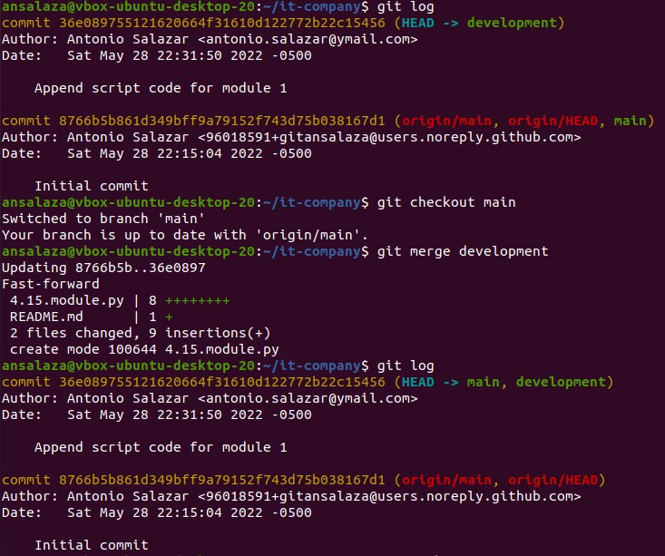
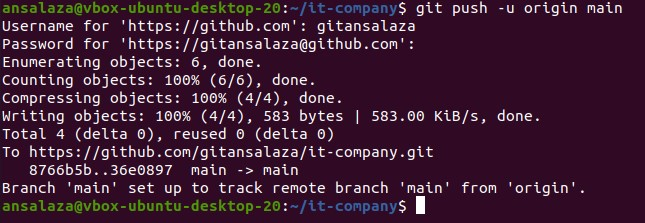
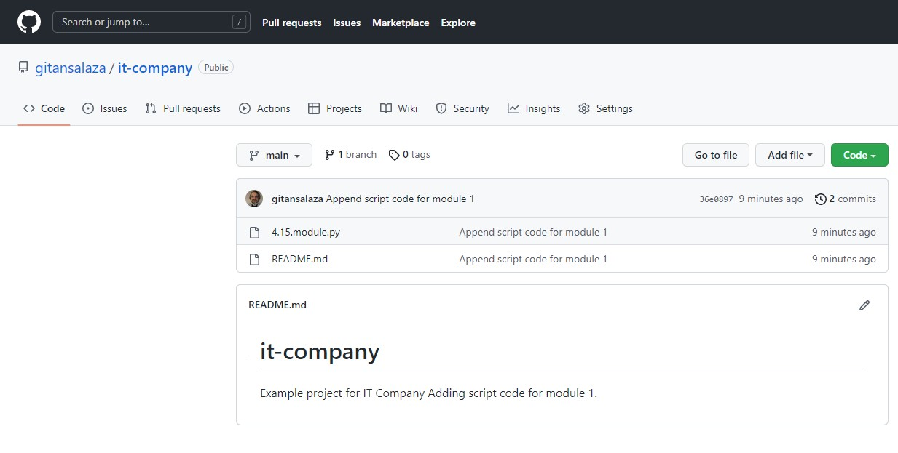
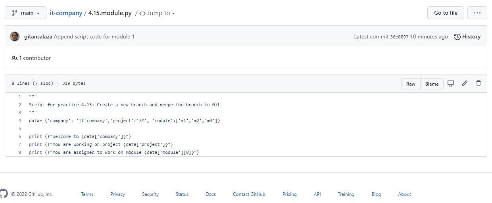

# Practice 4.15: Create a new branch and merge the branch in Git

Caltech | _Center for Technology & Management Education_ | Simpl¡Learn <br/>
Post Graduate Program in DevOps <br/>
PG DO - Configuration Management with Ansible and Terraform <br/>

- Assigned to: Antonio Salazar Gomez ([antonio.salazar@ymail.com](mailto:antonio.salazar@ymail.com))
- Updated on:  2022-05-28 
- Github repo: [gitansalaza/devops/course_02/practices/practice_4.15.md](https://github.com/gitansalaza/devops/blob/main/course_02/practices/practice_4.15.md)

# DESCRIPTION

To create a new branch and merge it in Git

**Description**: You are working in a IT company. Your company is working on a project which contains three modules and you have been asked to work on one of the module. Your company asked you to upload all the project files in the GitHub repository. You can create a new branch and work on it so that you don't impact the main code base. After you complete your module you can merge it into the master branch.

**Tools required**: Git

**Pre-requisites**: You must have installed Git in the lab in order to proceed. In case you do not have it please refer to Lesson 4 Demo 1 to install and setup Git.

**Expected Deliverables**:  Create a GitHub repository, clone the GitHub repository, create a new branch, switch between the branches, and merge the branch

<br/>

# Solution
## 1. Create a new GitHub repository.

  - Click on the **New** button.

  

  - Fill in the **Create a new repository** form.

  

## 2. Clone the repository on the local machine.

  >```
  > git clone https://github.com/gitansalaza/it-company.git
  > cd it-company
  >```

  

## 3. Create a new branch.

  >```
  > git branch development
  > git checkout development
  > git branch
  >```

  

## 4. Make changes on the new branch.

  - Add a comment to the README.md file.
  >```
  > echo "Adding script code for module 1." >> README.md ;
  >```

  - Append the script code file.
  >```
  > tee 4.15.module.py << EOF
  > """
  > Script for practice 4.15: Create a new branch and merge the branch in Git
  > """
  > data= {'company': 'IT company','project':'3M', 'module':['m1','m2','m3']}
  > 
  > print (f"Welcome to {data['company']}")
  > print (f"You are working on project {data['project']}")
  > print (f"You are assigned to work on module {data['module'][0]}")
  > EOF
  >```

  

  - Test the script code.
  >```
  > python3 4.15.module.py
  >```

  - Track the last changes and commit.
  >```
  > git add .
  > git commit -m "Append script code for module 1"
  >```

  

## 5. Switch to the main branch and perform merge the new branch.

  >```
  > git log
  > git checkout main
  > git merge development
  > git log
  >```

  

## 6. Push the main branch to the remote repository.

  >```
  > git push -u origin main
  > git log
  >```

  

## 7. Veify the changes on the GitHub repository.

  - Check the overall repository main page.

  

  - Review the code changes.

  


# Log file
[4.15.git_create_branch_and_merge.txt](logs/4.15.git_create_branch_and_merge.txt) 
