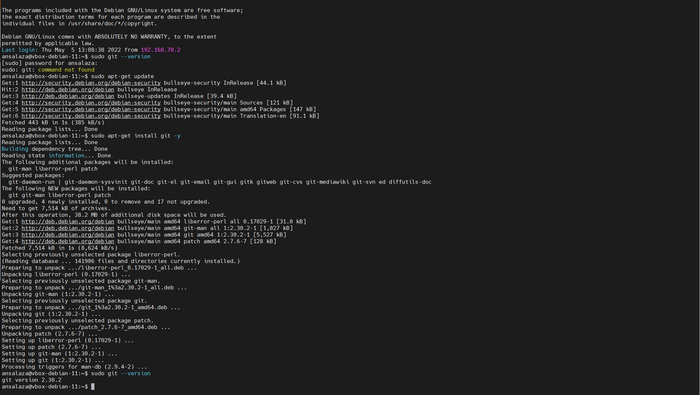
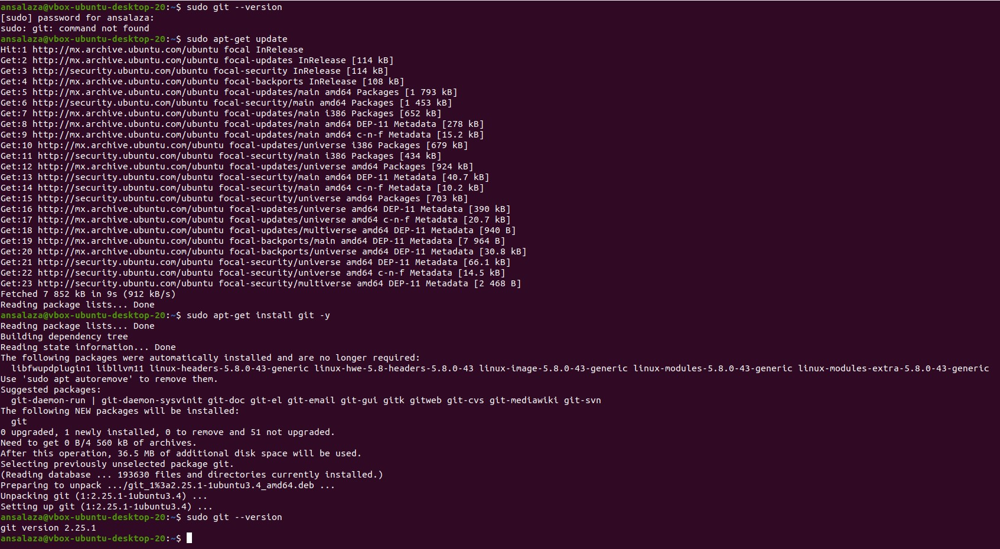
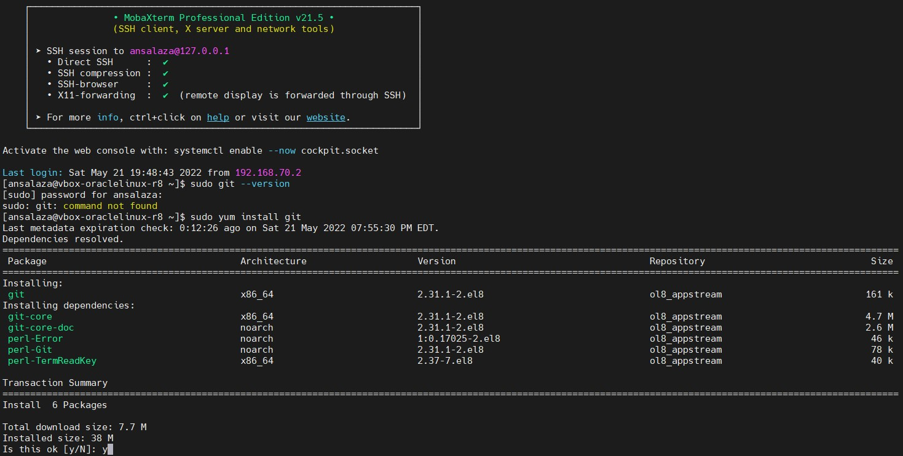
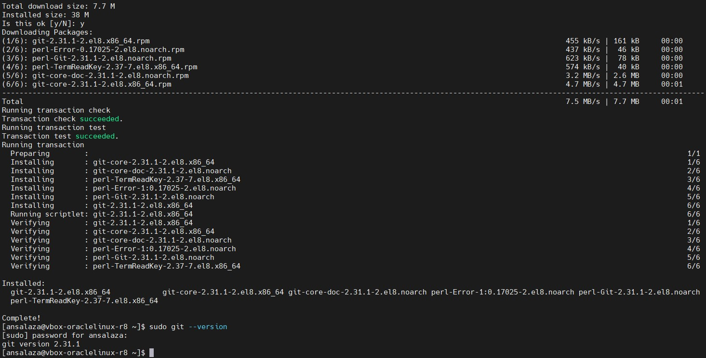
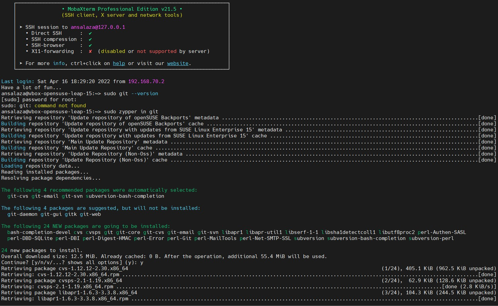
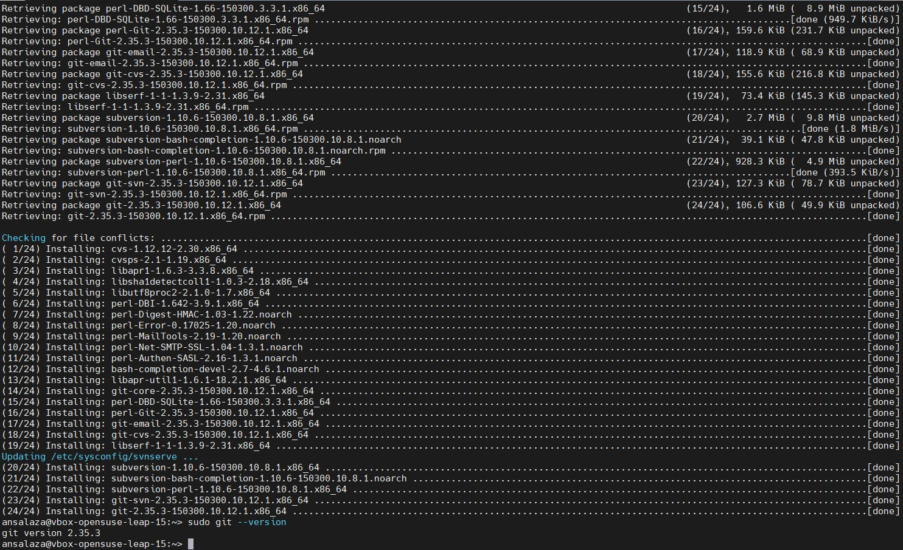
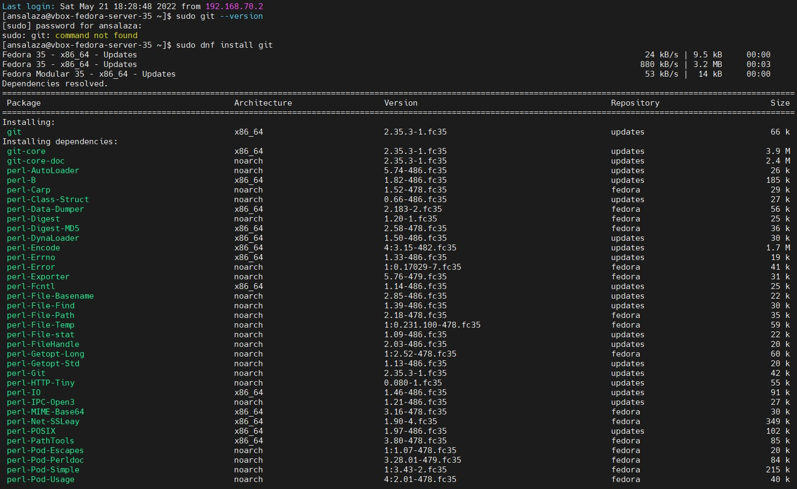
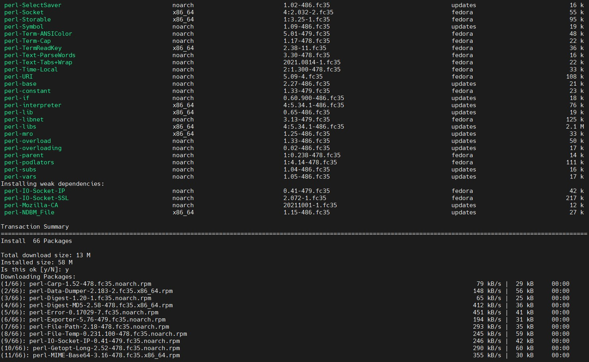
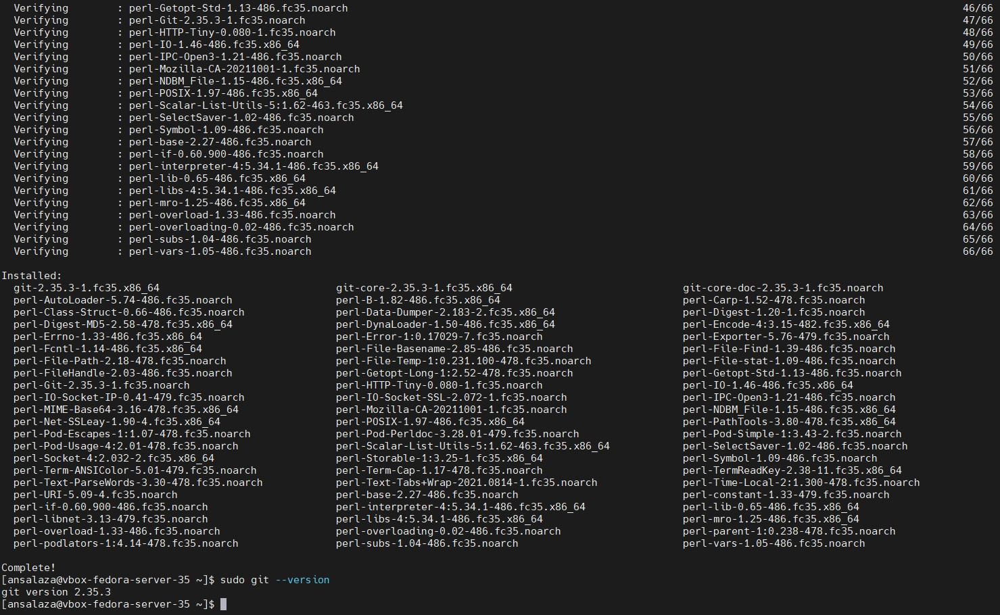

# Practice 4.3: Install Git on Linux

Caltech | _Center for Technology & Management Education_ | Simpl¡Learn <br/>
Post Graduate Program in DevOps <br/>
PG DO - Configuration Management with Ansible and Terraform <br/>

- Assigned to: Antonio Salazar Gomez ([antonio.salazar@ymail.com](mailto:antonio.salazar@ymail.com))
- Updated on:  2022-05-21 
- Github repo: [gitansalaza/devops/course_02/practices/practice_4.3.md](https://github.com/gitansalaza/devops/blob/main/course_02/practices/practice_4.3.md)

# DESCRIPTION
To install Git on Linux platform and verify the installation.
<br/>

**Tools required:** Git

Steps to be followed:
1. Verifying the installation.
2. Installing Git.

<br/>

# Solution steps 
## 1. Verifying the installation.
>```
> git --version
>```

## 2. Installing Git.
### On Debian based OS
>```
> sudo apt-get update
> sudo apt-get install git -y
>```

### On RHEL based OS
>```
> sudo yum install git -y
>```

### On Centos/Fedora based OS
>```
> sudo dnf install git
>```

### On SUSE based OS
>```
> sudo zypper in git
>```

<br/>

# Images

- ### Git installation on Debian11


- ### Git installation on Ubuntu20.04


- ### Git installation on Oracle Linux 8



- ### Git installation on openSUSE 15.3



- ### Git installation on Fedora 35




<br/>

