# Project 4.5: Create and Clone a GitHub Repository

Caltech | _Center for Technology & Management Education_ | Simpl¡Learn <br/>
Post Graduate Program in DevOps <br/>
PG DO - Configuration Management with Ansible and Terraform <br/>

- Assigned to: Antonio Salazar Gomez ([antonio.salazar@ymail.com](mailto:antonio.salazar@ymail.com))
- Updated on:  2022-05-22 
- Github repo: [gitansalaza/devops/course_02/practices/practice_4.5.md](https://github.com/gitansalaza/devops/blob/main/course_02/practices/practice_4.5.md)

# DESCRIPTION
To create and clone a GitHub repository.

<br/>

**Prerequisite:** Make sure you have a Github Account available. If not, please create one using the given link.

https://github.com/join?ref_cta=Sign+up&ref_loc=header+logged+out&ref_page=%2F&source=header-home

**Tools required:** Git

**Steps to be followed:**
1. Create a new Github repository.
2. Edit the README file.
3. Upload a file to the repository
4. Clone the Github repository

<br/>

# Solution steps 
## 1. Create a new Github repository.
- Go to [GitHub](https://github.com/).


- Login using your credentials.
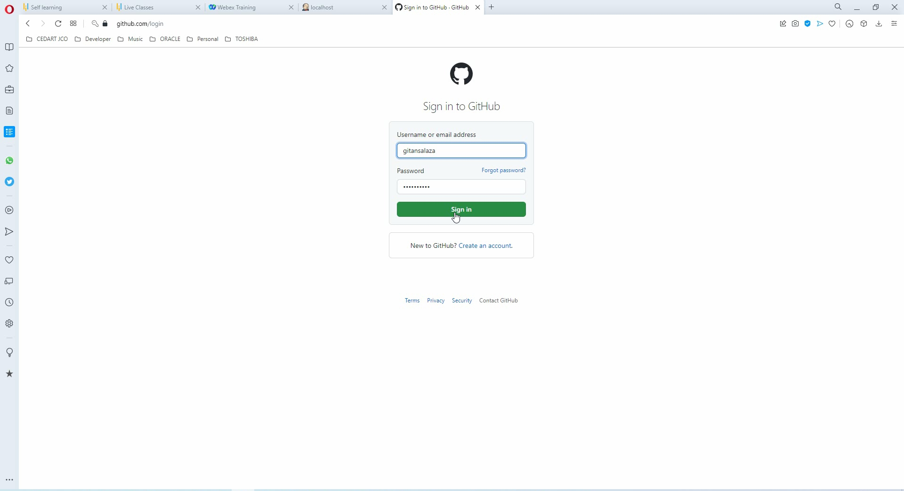

- On the right top menu click on the **Plus (+)** sign, then select the **New Repository** option from the drop down menu.
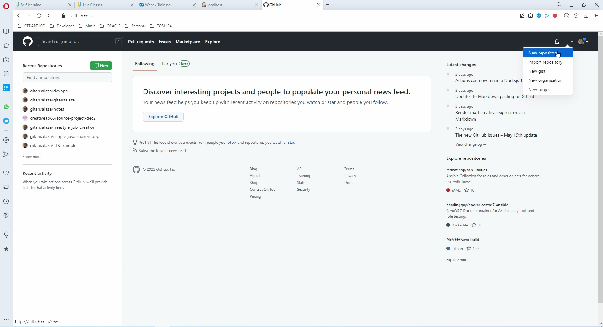

- Input the following data:
  - **Repository name**.
  - **Description**.
  - Select the **Public** repository access type.
  - Check the **Add a README file**.
  - After click on the **Create repository** button.
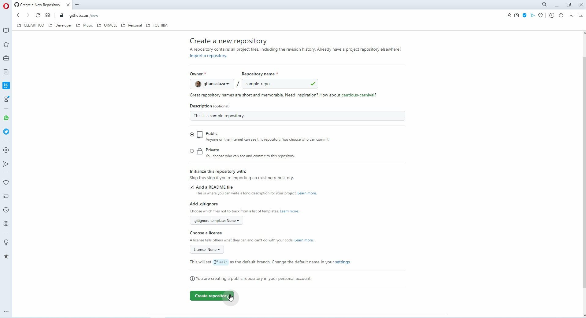

<br/>

## 2. Edit the README file.

- Click on the **Pencil** icon on the `main` branch screen.
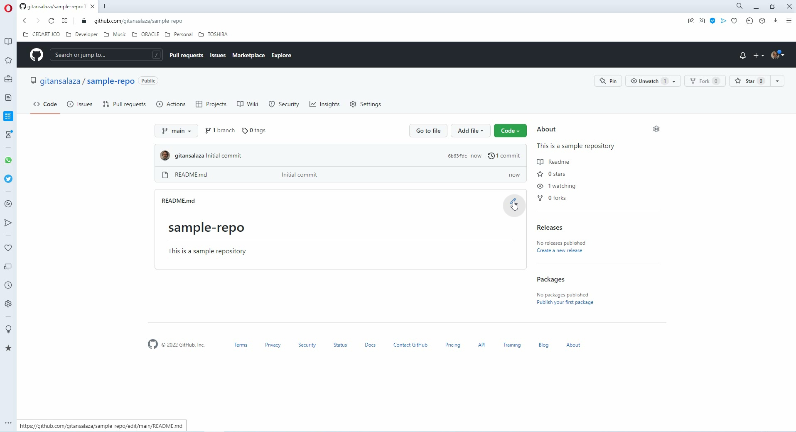

- Add a new line in the **\<>Edit file** screen.
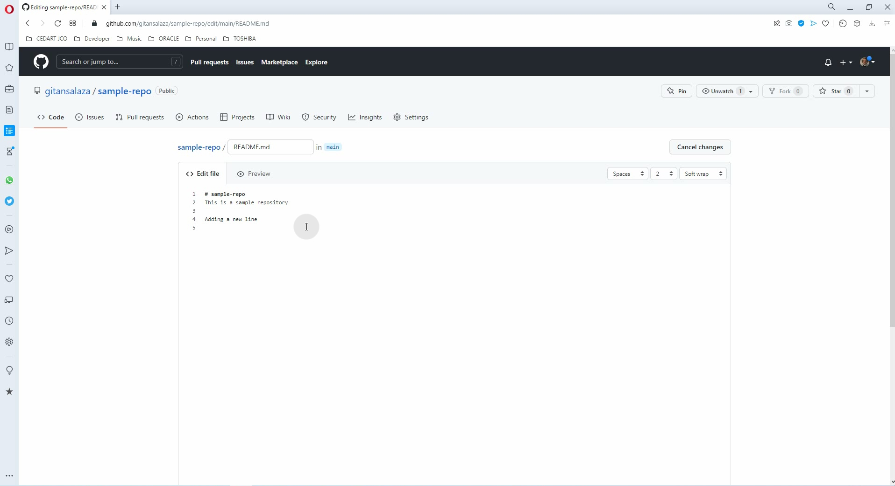

- Scroll down and click on the **Commit changes** button.
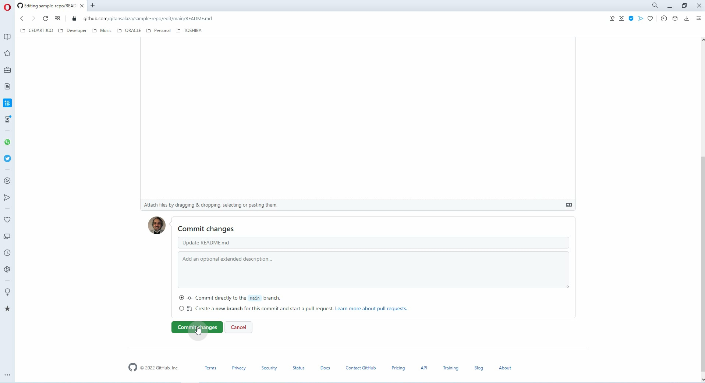

- Veify the changes are reflected in the **README.md** file.
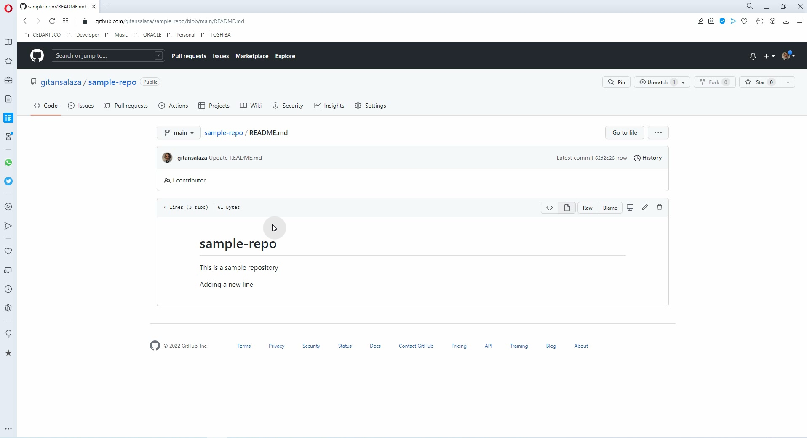

<br/>

## 3. Upload a file to the repository
- Go back to the **sample-repo** root.
- Open the **Add file** drop down menu and click on the **Create new file** option.
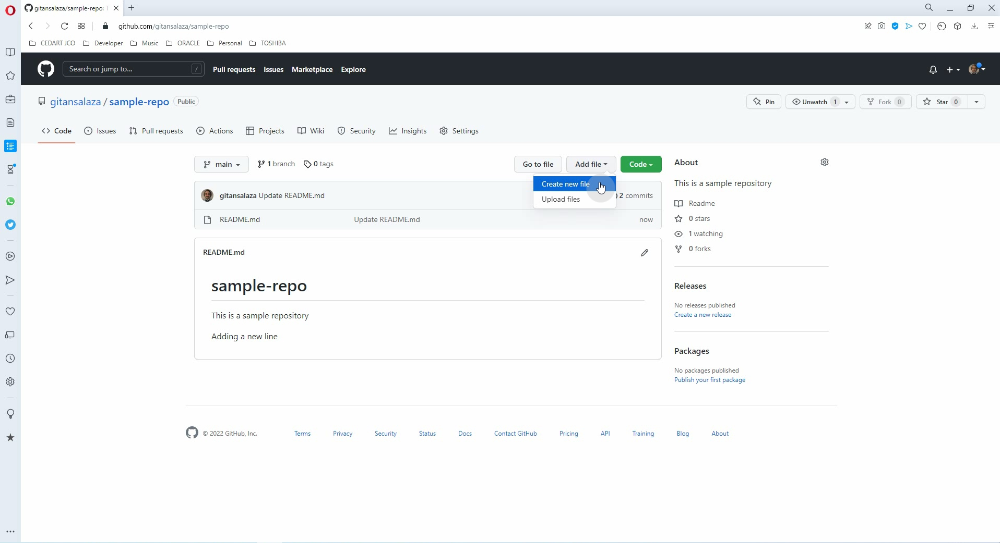

- Type the file name, in this example _SampleFile.txt_
- Then input the file contents on the **\<> Edit file** screen.
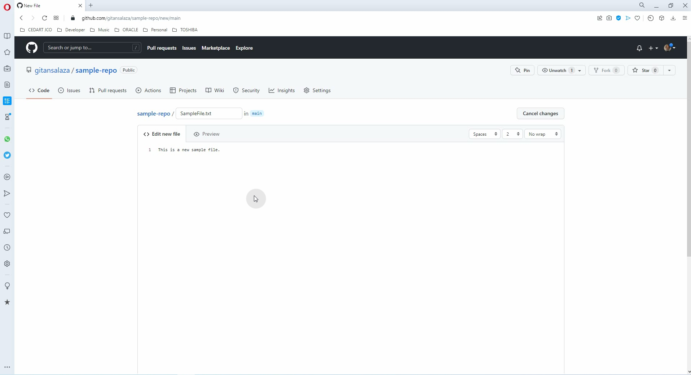

- Scroll down, select the commit directly to the `main` branch and, click on the **Commit new file** button.
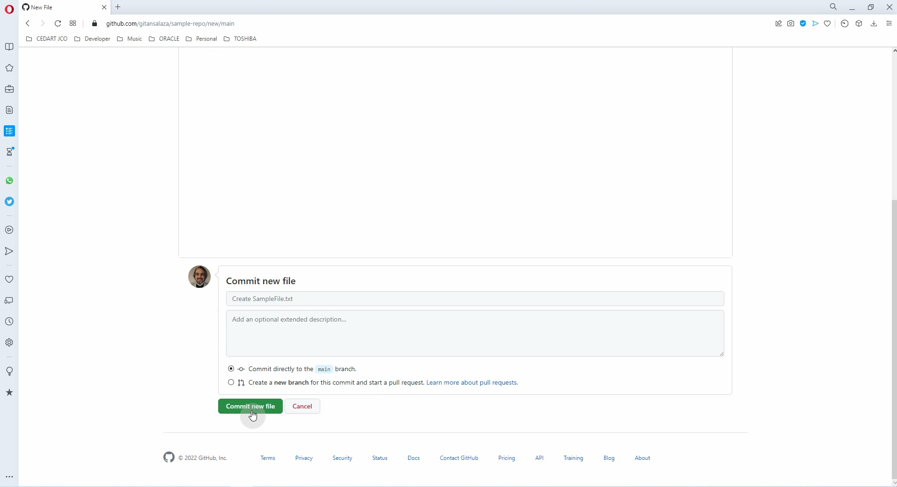

- The new file should appear in the `main` branch sample-repo screen.
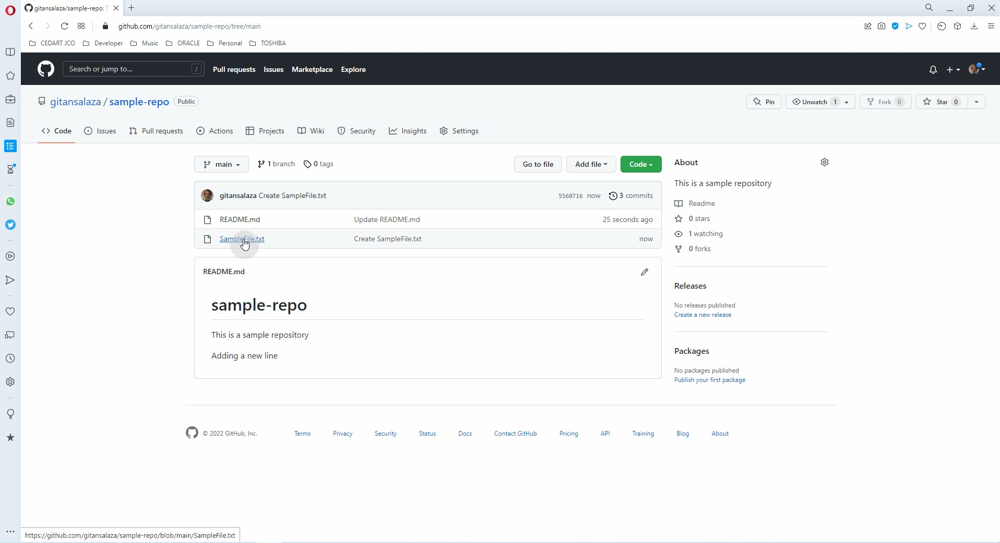

- Click over the file name to verify the changes are reflected.
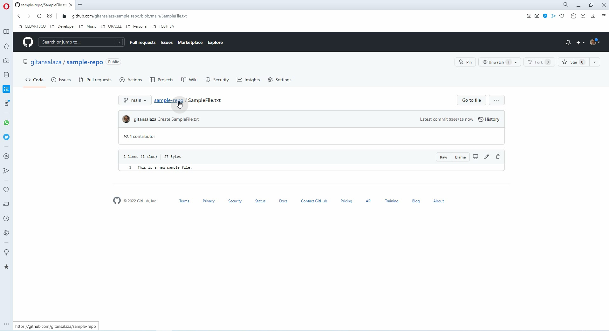

<br/>

## 4. Clone the Github repository
- Go back to the **sample-repo** root and click on the **Code** button.
- Then select **HTTPS** tab and click on the **Copy** icon to get the URL.
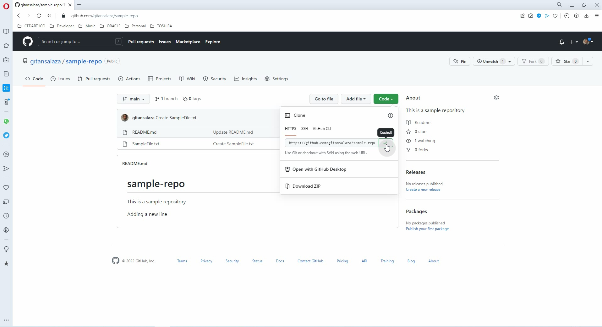

- Open your Linux host Terminal and type:
>```
> git clone <paste the URL copied in the previous step>
> ```

- Change to the new sample-repo directory.
>```
> cd sample-repo
> ```

- Verify the files have been successfully cloned.
>```
> ls -l
> cat README.md
> cat SampleFile.txt
> git remote -v
> ```

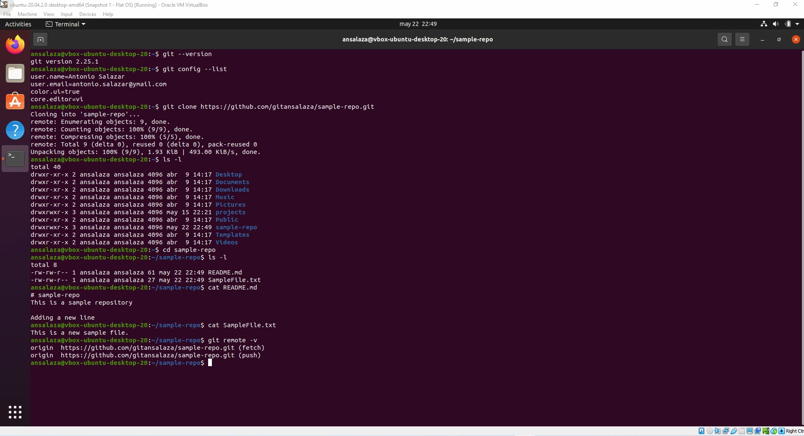

<br/>

# Logs
- [Git clone log file](logs/4.5_git_clone.txt)

<br/>

# Video
- [Create a new GitHub repository and clone it on a Linux Ubuntu host](https://youtu.be/UBo9tvKGbok)

<br/>