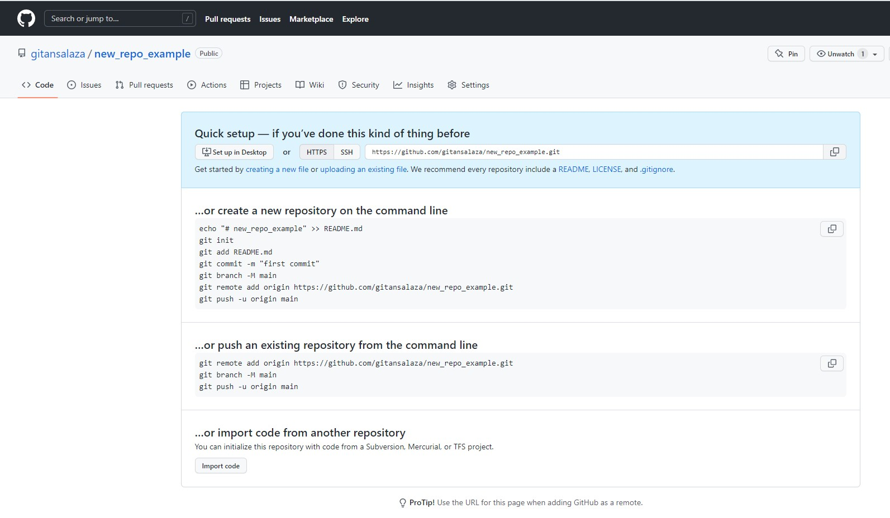
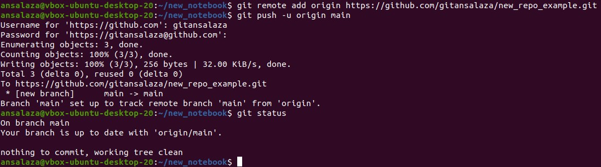
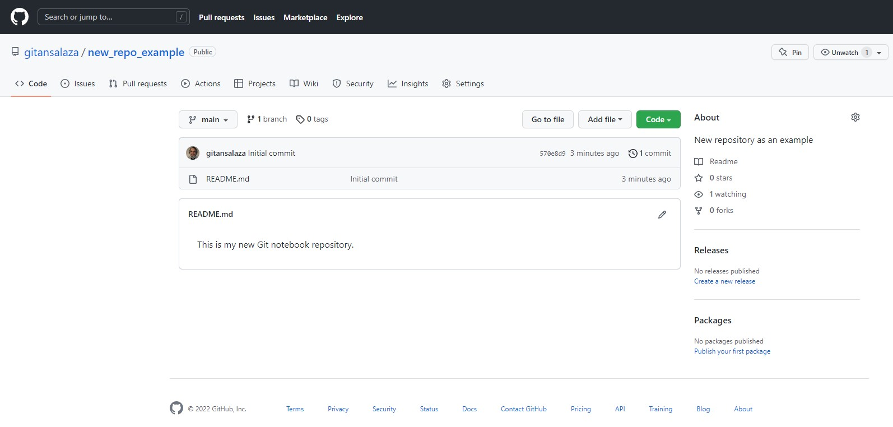

# Practice 4.8: Push file to GitHub Repository

Caltech | _Center for Technology & Management Education_ | Simpl¡Learn <br/>
Post Graduate Program in DevOps <br/>
PG DO - Configuration Management with Ansible and Terraform <br/>

- Assigned to: Antonio Salazar Gomez ([antonio.salazar@ymail.com](mailto:antonio.salazar@ymail.com))
- Updated on:  2022-05-22 
- Github repo: [gitansalaza/devops/course_02/practices/practice_4.8.md](https://github.com/gitansalaza/devops/blob/main/course_02/practices/practice_4.8.md)

# DESCRIPTION
To push file to GitHub Repository

Tools required: Git

Steps to be followed:

1. Create a GitHub repository.
2. Create a repository on the local machine.
3. Push the changes from the local repository to GitHub.
4. Check the status of the local and remote repository.

<br/>

# Solution
## 1. Create a GitHub repository.
- Please refer to the [How to create a new repository in GitHub](https://github.com/gitansalaza/devops/blob/main/git_and_github/repository/create_a_new_repository_in_github.md) document.

## 2. Create a repository on the local machine.
- Please refer to the [How to create a new repository in Git](https://github.com/gitansalaza/devops/blob/main/git_and_github/repository/create_a_new_repository_in_git.md) document.

## 3. Push the changes from the local repository to GitHub.

  - Go to the Github new reposiory main page and copy the HTTPS URL.

    

  - Back to the local host in the terminal add the remote repository.

    >```
    > git remote add origin <HTTPS GitHub repo URL>
    >```

  - Issue a push command to upload changes from the local repository to the remote one.

    >```
    > git push -u origin main
    >```

    


## 4. Check the status of the local and remote repository.

  - Go back to the GitHub repository main page and verify whether the changes were uploaded as expected.

    


# Log file
[4.8.git_create_a_new_repo.txt](logs/4.8.git_create_a_new_repo.txt) 
