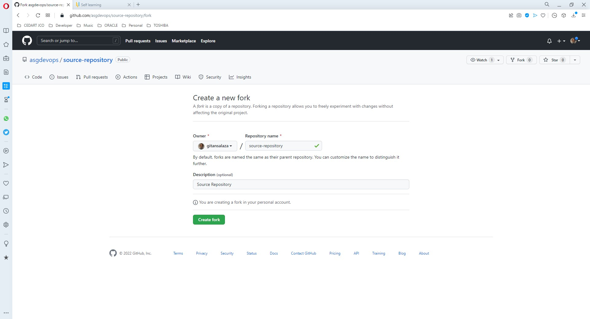

# Practice 4.8: Push file to GitHub Repository

Caltech | _Center for Technology & Management Education_ | Simpl¡Learn <br/>
Post Graduate Program in DevOps <br/>
PG DO - Configuration Management with Ansible and Terraform <br/>

- Assigned to: Antonio Salazar Gomez ([antonio.salazar@ymail.com](mailto:antonio.salazar@ymail.com))
- Updated on:  2022-05-22 
- Github repo: [gitansalaza/devops/course_02/practices/practice_4.8.md](https://github.com/gitansalaza/devops/blob/main/course_02/practices/practice_4.8.md)

# DESCRIPTION
To push file to GitHub Repository

Tools required: Git

Steps to be followed:

1. Create a GitHub repository.
2. Create a repository on the local machine.
3. Push the changes from the local repository to GitHub.
4. Check the status of the local and remote repository.

<br/>

# Solution
## 1. Create a Fork. 

- Create a public repository on your source [GitHub](https://github.com) account. 
  
    _In this example the source respository is [source-repository](https://github.com/asgdevops/source-repository)._

    

- Click on the **Code** button, select the **HTTPS** tab and click on the **copy** button.
 
    

- In your browser, go to the destination GitHub account and paste the HTTPS URL copied in the previous step.

    _In this case the destination account is **gitansalaza**._

    

- Click on the **Create Fork** button.

    _The [source-repository](https://github.com/asgdevops/source-repository) appears in the destination account now._

    

- In the destination account, click on the **Code** button, select the **HTTPS** tab and click on the **copy** button.

    

<br/>

## 2. Clone your Fork.
- On your local host, open an SSH terminal and type: `git clone <https URL copied in the previous step>`

    

    From now onwards, you will need to create a **Personal access token** in order to work with your remote repository.

    Refer to the [How to create a new token in GitHub](https://github.com/gitansalaza/devops/tree/main/token) steps.

<br/>

## 3. Sync fork with the original repository.
- On your local host go to **source-repository**, set up the remote repository just cloned in the previous step.

    >```
    > cd source-repository
    > git remote -v
    > git remote add upstream <https source repository URL>
    > git push 
    > # Enter your personal access token 
    >```

    

<br/>

## 4. Push your Changes.    

- Go to your local source-repository, edit the README.md file and push it to your destination remote repository just cloned. _In this example the destination repository exists under **gitansalaza** account_

    >```
    > cd source-repository
    > vi README.md
    > # Edit the file and make some changes 
    > # Save the file and exit
    > git add .
    > git commit -m "<comment>"
    > git push origin
    >```

    

<br/>

## 5. Create a Pull Request.
- In your destination respository click on the **Create pull request** button.

    

- Comment about what the pull request is about including the changes you are proposing.

- Go to the source repository GitHub account.
- Click on the **Pull requests** tab.
    
    The pull request details should appear in the [source-respository pull requests](https://github.com/asgdevops/source-repository/pulls?q=is%3Apr+is%3Aclosed)

    

- Select the pull request you are interested in, and click on the **Merge pull request** button to accept the changes proposed by the GitHub account contributor.

    

- Click on the **Confirm merge** button.

    

- A confirmation page is diesplayed.

    

- Verify the changes are reflected by opening your [source-repository](https://github.com/asgdevops/source-repository) main from your source GitHub account.
  
    


