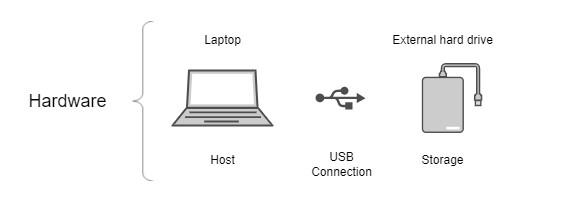
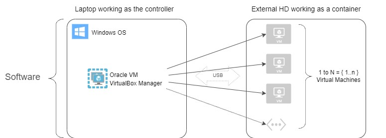
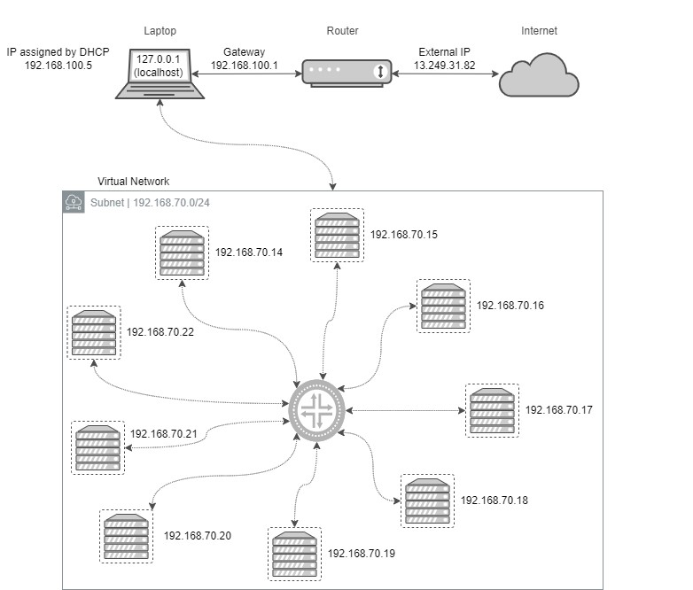
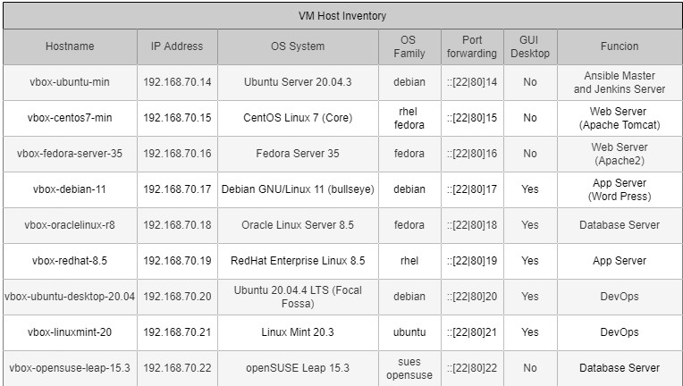
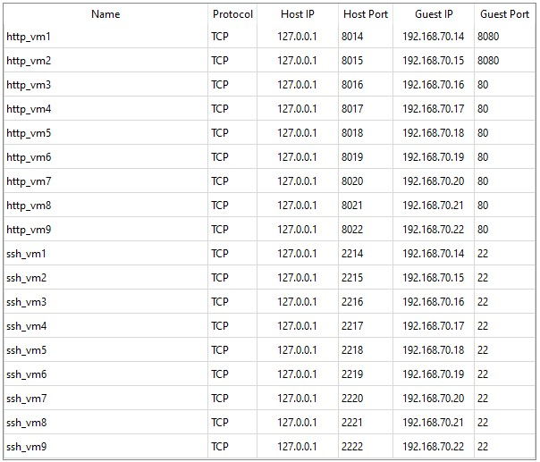
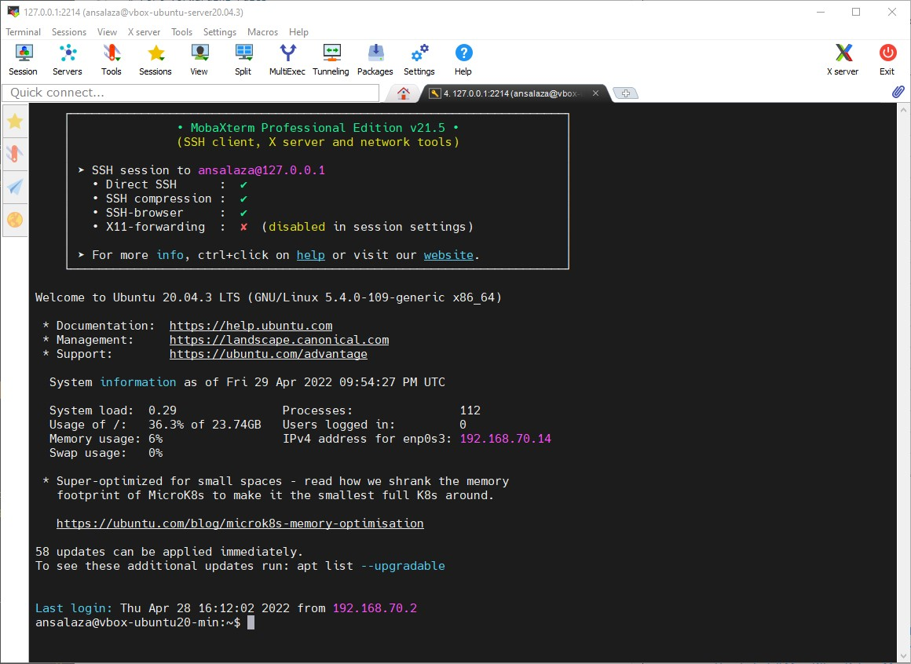
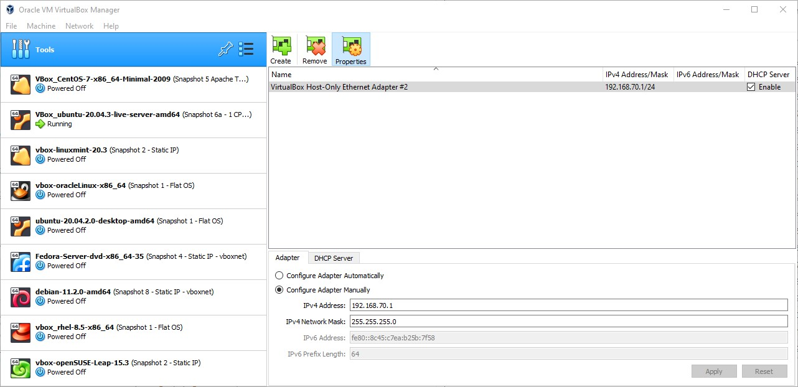
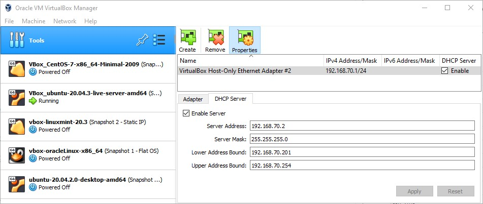

# Project 0: Building a home laboratory

- by: Antonio Salazar Gomez ([antonio.salazar@ymail.com](mailto:antonio.salazar@ymail.com))
- Updated on:  2022-04-20 
- Github repo: [gitansalaza/devops](https://github.com/gitansalaza/devops/blob/main/project_01_ci-cd_deployment_using_ansible_cm_tool.md)

# Description

Build a home lab capable of connecting at least two virtual machines.

# Summary

- Use your laptop or personal computer as a host.
- Plug a USB external Hard Drive device into the laptop to use it as storage.
- Choose Oracle VirtualBox software to install and set up the virtual machines.
- Install as many virtual machines as you want with VirtualBox. Preferable setup Linux-based Operating Systems in your virtual machines.
- Create a virtual network in Oracle VirtualBox to connect different virtual machines.
- Set up a gateway connection using port forwarding between the virtual network and your laptop (or PC) host.
- Ensure the VM has the port open you need to connect from the laptop to the VM.

 

# Home lab architecture

The picture below shows the home lab architecture.

Here the laptop works as the main host, whereas the USB external Hard Drive acts as the storage.

 

The laptop host runs under Windows 10 OS, on top of it running Oracle VirtualBox software as the VM manager controller.

 

# Lab network 

The laptop has an Internet connection by the Internet Service Provider's (ISP) router. 
- The router is connected to the ISP Network.
- In this example, the router was assigned the IP address 13.249.31.82
- The router created a subnet with CIDR 192.168.100.0/24, which gateway address is 192.168.100.1
- Thus, the laptop was assigned the IP address 192.168.100.5 by DHCP.
- The virtual network has the subnet with CIDR 192.168.70.0/24 with gateway address 192.168.70.1
- As a result, each VM was assigned an address between 192.168.70.14 and 192.168.70.22

 

# Virtual machine inventory

Each virtual machine has a different OS, IP address and purpose.
The table blow shows the VM inventory details.

 

# Port forwarding rules

The following table shows an example of the port forwarding rules used when setting up the virtual network so that it is possible to connect from 
an SSH terminal to a VM or from a browser to a VM.

 

# Localhost to VM connection examples
The following examples show how to connect from the laptop host inside the VM server or application.

## Connecting through an SSH terminal

## Getting inside a VM application through a Web browser

# Oracle VritualBox Manager

The pictures below provide an example of how the Oracle VirtualBox manager looks when setting up the virtual network.

DCHP setup

