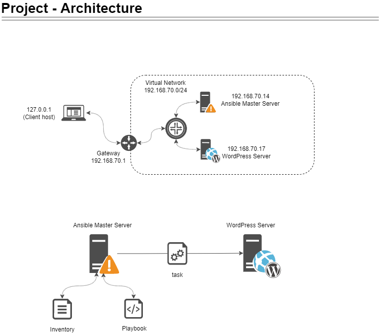
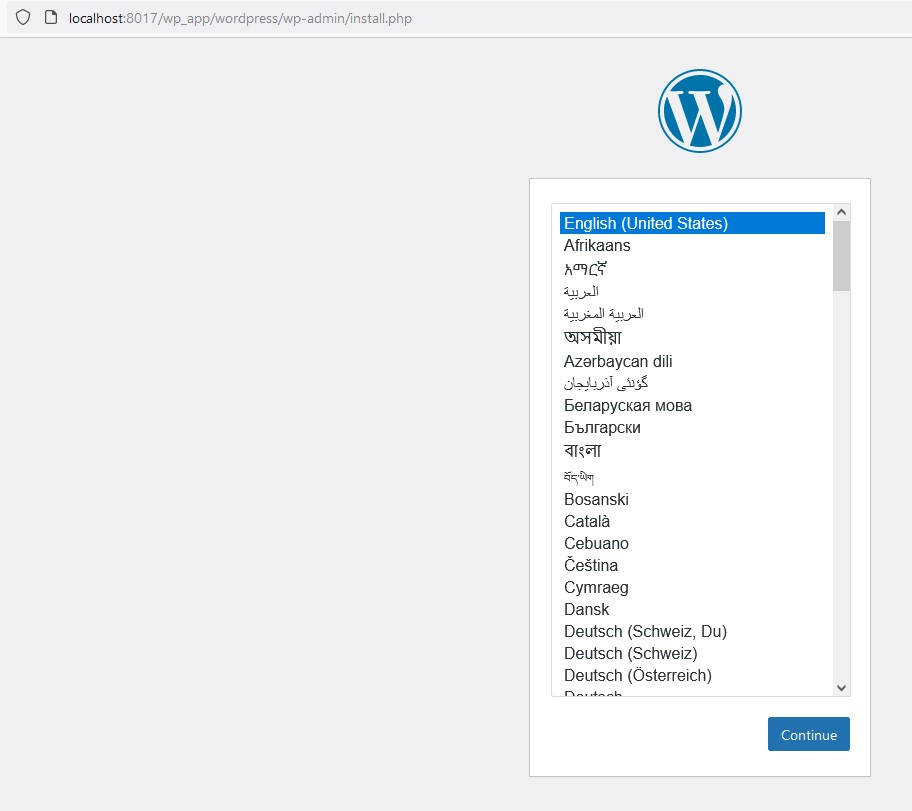
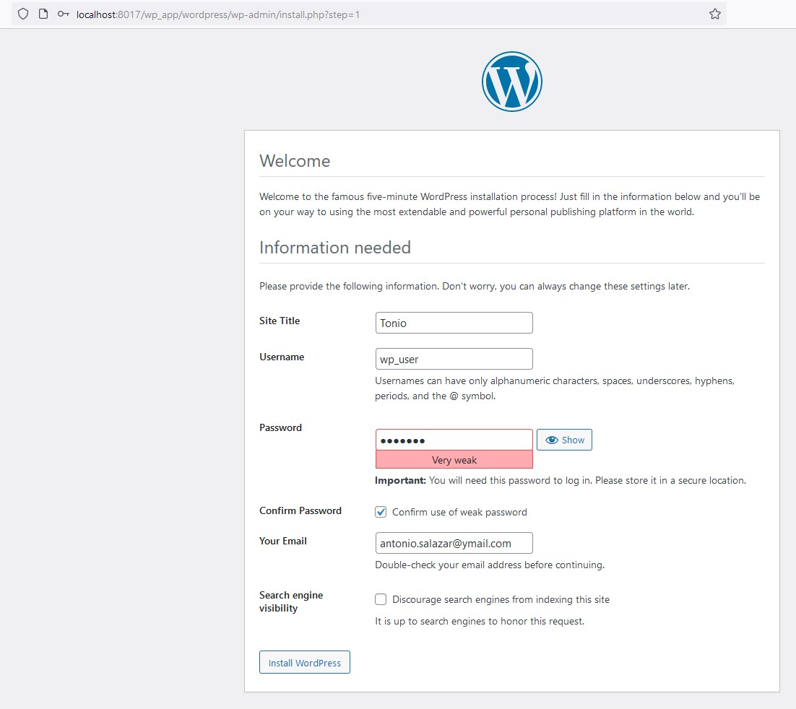
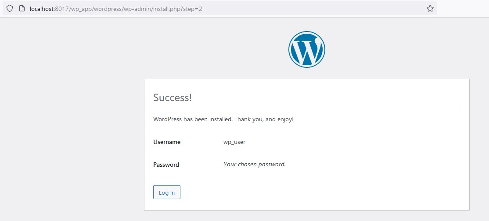
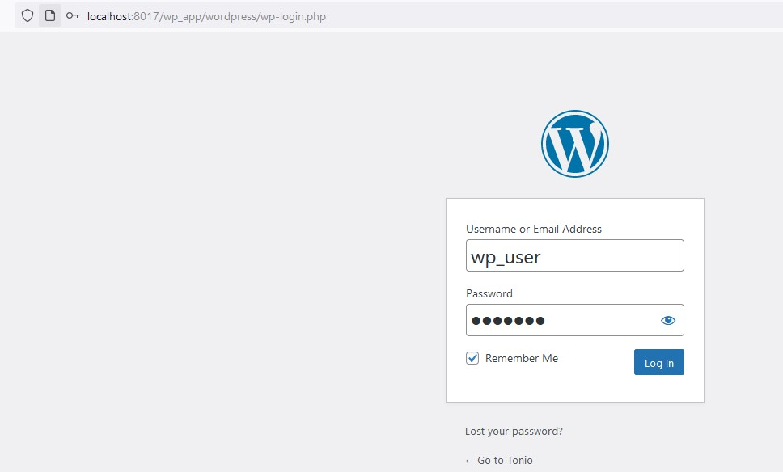
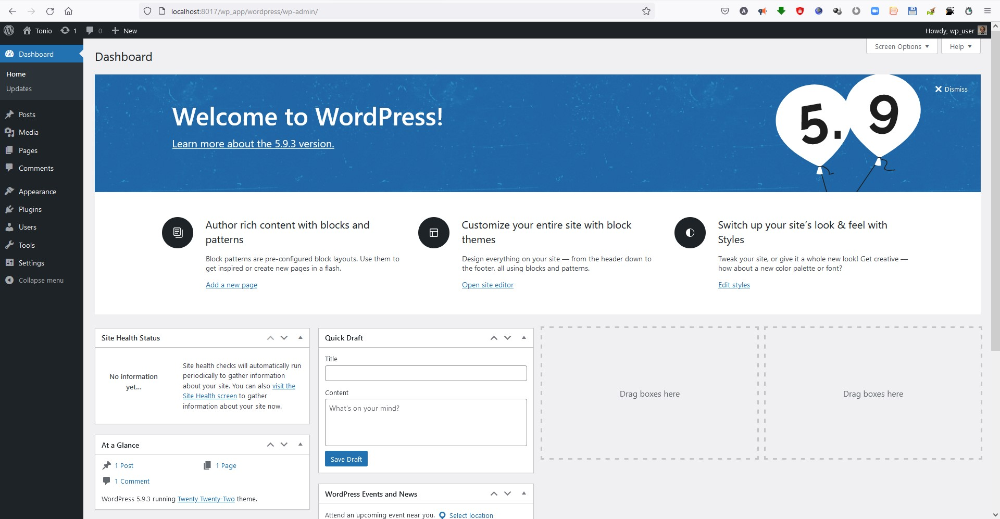

# Project 2: Deployment of WordPress Environment

Caltech | _Center for Technology & Management Education_ | Simpl¡Learn <br/>
Post Graduate Program in DevOps <br/>
PG DO - Configuration Management with Ansible and Terraform <br/>

- Assigned to: Antonio Salazar Gomez ([antonio.salazar@ymail.com](mailto:antonio.salazar@ymail.com))
- Updated on:  2022-05-04 
- Github repo: [gitansalaza/devops/course_03/project_02/project_02_deployment_of_wordpress_environment.md](https://github.com/gitansalaza/devops/blob/main/course_03/project_02/project_02_deployment_of_wordpress_environment.md)


# DESCRIPTION
You are a DevOps engineer at XYZ Ltd. Your company is working mostly on WordPress projects. A lot of development hours are lost to perform WordPress setup with all dependencies like PHP, MySQL, etc. The Company wants to automate it with the help of a configuration management tool so that they can follow a standard installation procedure for WordPress and its components whenever a new requirement or client comes in. The below mentioned components should be included:

- PHP
- Nginx/Apache Web Server
- MySQL
- WordPress

# Steps to perform 
## Summary

- Establish configuration management master connectivity with the WordPress server.
- Validate the connectivity from the master to the worker machine.
- Prepare IaC scripts to install WordPress and its dependent components.
- Execute scripts to install the entire WordPress environment.
- Validate installation using the public IP of VM by accessing the WordPress application.

# Execution details
- ## Establish configuration management master connectivity with WordPress server
    First define the infrastructure capable of connecting at least two virtual machines.

    1. The Ansible master server.
    2. The WordPress server.

    <br/>

    The document named '[Building a home laboratory](../project_00/project_00_building_a_home_lab.md)'  shows a simple method to connect the virtual machines.

    In summary the architecture of the project is shown by the picture below:

    

- ## Validate connectivity from master to slave machine

    Let us imagine a scenario where there are three different OS user accounts:
    
    a) The **system administrator** user account with full privileges. <br />
    b) An **Ansible admin** user account used for administrating the Ansible Master server. <br />
    c) Another account assigned to **DevOps Builder** account used to run ansible playbooks.

    The system administrator creates and grants privileges to the **Ansible admin** user, which also creates and grans privileges to the **DevOps builder** user account.

    

  ### Creating the **Ansible admin** user account
    1. Create an administrator user account in the Ansible Master server and the WordPress working machine accordingly.

        >```
        > # as root
        > read -p 'Please enter the username: ' user ;
        > read -p "Please enter the $user password: " -s password ; 
        > useradd -p $(openssl passwd -crypt $password) $user -m -s /bin/bash ; 
        >```

    _Execute the commands above in both servers: the Master and the WordPress one._

    2. Grant *sudo* privilege to the **admin** user account:
       
        >```
        > # debian like family
        > usermod -aG sudo $user ; 
        > 
        > # rhel/fedora like family
        > usermod -aG wheel $user  ;
        > 
        > # add the admin user account to the /etc/sudoers file
        > is_user_sudoer=`grep -E "^$user" /etc/sudoers | wc -l` ;
        >
        > if [ $is_user_sudoer -eq 1 ]; then
        >     sed "s/^${user}.*/$user\tALL=(ALL:ALL)\tNOPASSWD\:ALL/g" /etc/sudoers > /etc/sudoers.new ;
        > else 
        >     sed "/^root.*/a $user\tALL=(ALL:ALL)\tNOPASSWD\:ALL" /etc/sudoers > /etc/sudoers.new ;
        > fi 
        > mv /etc/sudoers.new /etc/sudoers ;

    3.  Allow the **admin** account connecting through SSH.

        >```
        > find_allow_users=`grep -E '^AllowUsers' /etc/ssh/sshd_config | wc -l` ;
        > if [ $find_allow_users -eq 0 ]; then
        >     echo "AllowUsers $USER" >> /etc/ssh/sshd_config ;
        > else
        >     sed "/^AllowUsers.*/ s/$/\ $user/" /etc/ssh/sshd_config > /etc/ssh/sshd_config.new ;
        >     mv /etc/ssh/sshd_config.new /etc/ssh/sshd_config ;
        > fi
        >```

    4. Restart SSHD service.
        >```
        > systemctl restart sshd ;
        >```

    5. _Repeat steps 1 to 4 on the WorkPress server host on a different terminal._

    6. Login with the **admin** user account just created.

        >```
        > su - $user
        >```

    7. Create the **admin** user SSH key.

        >```
        > ssh-keygen -b 4096 -t rsa -f ~/.ssh/id_rsa -q -N "" ;
        > ls -l ~/.ssh/id_rsa* ;
        >```

    8. Add the SSH key to the *authorized_key* and *known_hosts* files.

        >```
        > cat .ssh/id_rsa.pub >> .ssh/authorized_keys ;
        > ssh localhost -p 22 ;
        > exit ;
        >```

    9. Now append the SSH key to the WordPress host (_Replace the IP with your host's IP or server name accordingly_)

        >```
        > host=192.168.70.17 ;
        > ssh-copy-id ${host} -p 22 ;
        > exit ;
        >```

- ### Creating the **ansible admin** by the *setup_user.sh* automated script
  1. Copy the scripts [logger.sh](scripts/logger.sh]) and [setup_user.sh](scripts/setup_user.sh]) to your ~/scripts directory.
  2. Run the script as **root** or with **sudo** privileges.

      >```
      > # as root
      > ./setup_user.sh
      >
      > # or with sudo privileges
      > sudo ./setup_user.sh
      >```

  3. The script will prompt for the **admin** username and its password.
  4. After running the script on the **master** and **destination** hosts, switch to the new admin user. `su - $user`
  - Copy and run the [setup_sshkey.sh](scripts/setup_sshkey.shy.sh) script.

<br/>

- ### Prepare IaC scripts to install WordPress and its dependent components

  1. Create the inventory file.

      >```
      > # as ansible admin user
      > mkdir -p ~/scripts
      > cd ~/scripts
      > tee wp_servers.inv 0<<EOF
      > [master]
      > 192.168.70.14
      > 
      > [wp_server]
      > 192.168.70.17
      > EOF
      >
      > cat wp_servers.inv ;
      >```

  2. Test the ansible connection between the master and WordPress servers.

      >```
      > ansible all -i wp_servers.inv -m ping
      >```

  3. Create the ansible *vault key* file used to run the next following ansible playbooks.

       - Enter the following values:
       - The ansible vault password. (_save it and keep it safe_)

       >```
       > read -p "1) Enter the 'Vault Password': " -s vault_password ; 
       > echo "$vault_password" | sed 's/./*/g';
       >```

       - Admin user account credentials.

       >```
       > echo  "2) The admin user is: $USER" ;
       > read -p "3) Enter the $USER user password: " -s admin_password ; 
       > echo "$admin_password" | sed 's/./*/g';
       >```

       - Devops user account credentials.

       >```
       > read -p '4) Enter the build username: ' build_username ;
       > read -p "5) Enter the $build_username user password: " -s build_password ;
       > echo "$build_password" | sed 's/./*/g';
       >```

       - WordPress server hostname, IP address, or ansible group name (set up by the inventory).

       >```
       > read -p '6) Enter the destination host: [name | IP | group ]: ' dest_host ;
       >```

       - Now create and encrypt the vault key 

       >```
       > [ -f .stvltkey ] && rm -f .stvltkey ;
       > echo "$vault_password" > .stvltkey ;
       > chmod 400 .stvltkey ;
       > unset vault_password ;
       >```

  4. Create and encrypt the *setup_vars.yaml* variables file.
 
       - Create the variables file used by the admin and devops user accounts.

       >```
       > echo "---" > setup_vars.yaml ;
       > echo "admin_username: ${USER}" >> setup_vars.yaml ;
       > echo "admin_password: ${admin_password}" >> setup_vars.yaml ;
       > echo "build_username: ${build_username}" >> setup_vars.yaml ;
       > echo "build_password: ${build_password}" >> setup_vars.yaml ;
       > echo "..." >> setup_vars.yaml ;
       >```

       - Build the first part of the variables file used to set up the WordPress server.

       >```
       > echo "---" > wp_vars.yaml ;
       > echo "build_username: ${build_username}" >> wp_vars.yaml;
       > echo "build_password: ${build_password}" >> wp_vars.yaml ;
       >```

       - Finally encrypt the setup_vars.yaml variables file.

       >```
       > ansible-vault encrypt setup_vars.yaml --vault-password-file=.stvltkey;
       >```

       _Notice The steps above can be executed by the [setup_vars.sh](scripts/setup_vars.sh) automated script._

  5. Prepare the [setup_user.yaml](scripts/setup_user.yaml]) playbook to create the devops (build_user) user.
      >```
      > ---
      >   - name: Setup the {{ build_username }} build user account on the {{ server }} host(s)
      >     hosts: "{{ server }}"
      >     gather_facts: yes
      >     vars_files: ~/scripts/setup_vars.yaml 
      >     vars:
      >       ansible_become: yes 
      >       ansible_become_method: sudo
      >       ansible_become_pass: "{{ admin_password }}"
      >       group_name: "{{ 'sudo' if ansible_os_family == 'Debian' else 'wheel' }}"
      >    
      >     tasks:
      >       - name: Create the {{ build_username }} user and generate the ssh key
      >         user:
      >           name: "{{ build_username }}"
      >           password: "{{ build_password | password_hash('sha512') }}"
      >           groups: "{{ group_name }}"
      >           state: present
      >           append: yes
      >           createhome: yes
      >           shell: /bin/bash 
      >           generate_ssh_key: yes
      >           ssh_key_type: rsa
      >           ssh_key_bits: 4096
      >           ssh_key_file: /home/{{ build_username }}/.ssh/id_rsa
      > 
      >       - name: Create /home/{{ build_username }}/.ssh directory
      >         file:
      >           path: /home/{{ build_username }}/.ssh
      >           state: directory
      >           mode: 0755
      > 
      >       - name: Deploy SSH Public Key
      >         authorized_key:
      >           user: "{{ build_username }}"
      >           state: present
      >           key: "{{ lookup('file', '/home/{{ build_username }}/.ssh/id_rsa.pub') }}"
      > 
      >       - name: Allow user {{ build_username }} to log in
      >         shell: |
      >           find_allow_users=`grep -E '^AllowUsers' /etc/ssh/sshd_config | wc -l` ;
      > 
      >           if [ $find_allow_users -eq 0 ]; then
      >             echo "AllowUsers {{ build_username }}" >> /etc/ssh/sshd_config ;
      >           else 
      >             sed "/^AllowUsers.*/ s/$/\ {{ build_username }}/" /etc/ssh/sshd_config > /etc/ssh/sshd_config.    new > ;
      >             mv /etc/ssh/sshd_config.new /etc/ssh/sshd_config ;
      >           fi ;
      > 
      >           exit 0
      >         args:
      >           executable: /bin/bash
      > 
      >       - name: Restart SSHD service
      >         service:
      >           name: sshd
      >           state: restarted        
      > ...
      >```

  6.  Prepare the [wp_install.yaml](scripts/wp_install.yaml) playbook.

      >```
      > # Name:        wp_install.yaml
      > # Description: install WordPress server 
      > # Author:      Antonio Salazar (antonio.salazar@ymail.com)
      > # Date:        2022-04-30
      > ---
      >   - name: Setup the WordPress Server on {{ server }} host
      >     hosts: "{{ server }}"
      >     gather_facts: yes
      >     vars_files: ~/scripts/wp_vars.yaml 
      >     vars:
      >       ansible_become: yes 
      >       ansible_become_method: sudo
      >       ansible_become_pass: "{{ build_password }}"
      > 
      >     tasks:
      >       - name: Install Apache Web Server package on Debian OS family
      >         apt: name=apache2 state=present update_cache=yes
      >         when: ansible_os_family=="Debian"
      > 
      >       - name: Install Apache Web Server package on RHEL OS family
      >         yum:  name=httpd state=present
      >         when: ansible_os_family=="RedHat"
      > 
      >       - name: Install PHP packages on Debian OS family 
      >         apt: name={{ item }} update_cache=yes state=latest
      >         loop:
      >           - libapache2-mod-php 
      >           - php
      >           - php-common
      >           - php-mysql
      >           - php-tidy
      >           - php-xml
      >           - php-xmlrpc
      >           - php-mbstring
      >           - php-memcached
      >           - php-curl
      >           - php-zip
      >           - php-pear 
      >           - php-cgi 
      >           - php-net-socket 
      >           - php-gd 
      >           - php-xml-util 
      >           - php-php-gettext 
      >           - php-bcmath 
      >           - unzip 
      >           - wget 
      >           - git 
      >           - python3
      >           - python3-pip
      >           - python3-mysqldb
      >         when: ansible_os_family=="Debian"
      > 
      >       - name: Install PHP packages on RHEL OS family 
      >         yum: name={{ item }} state=latest
      >         loop:
      >           - libapache2-mod-php 
      >           - php
      >           - php-common
      >           - php-mysql
      >           - php-tidy
      >           - php-xml
      >           - php-xmlrpc
      >           - php-mbstring
      >           - php-memcached
      >           - php-curl
      >           - php-zip
      >           - php-pear 
      >           - php-cgi 
      >           - php-net-socket 
      >           - php-gd 
      >           - php-xml-util 
      >           - php-php-gettext 
      >           - php-bcmath 
      >           - unzip 
      >           - wget 
      >           - git 
      >           - python3
      >           - python3-pip
      >           - python3-mysqldb
      >         when: ansible_os_family=="RedHat"
      > 
      >       - name: Install PyMySQL package
      >         pip: 
      >           name: pymysql 
      >           state: present
      > 
      >       - name: Setup MariaDB repository 
      >         shell: curl -sS https://downloads.mariadb.com/MariaDB/mariadb_repo_setup | bash warn=False    
      > 
      >       - name: Install MariaDB latest on Debian OS family
      >         apt: name={{ item }} update_cache=yes state=latest
      >         loop:
      >           - mariadb-server
      >           - mariadb-client
      >         when: ansible_os_family=="Debian"
      > 
      >       - name: Install MariaDB latest RHEL OS family
      >         yum: name={{ item }} state=latest
      >         loop:
      >           - mariadb-server
      >           - mariadb-client
      >         when: ansible_os_family=="RedHat"
      > 
      >       - name: Restart MariaDB service
      >         service: 
      >           name: mysql 
      >           state: restarted
      > 
      >       - name: Verify if /home/{{ build_username }}/scripts if exists
      >         stat:
      >           path: "/home/{{ build_username }}/scripts"
      >         register: stat_result
      > 
      >       - name: Create /home/{{ build_username }}/scripts if does not exist
      >         file: 
      >           path: "/home/{{ build_username }}/scripts"
      >           state: directory
      >         when: stat_result.stat.exists == False
      > 
      >       - name: Setup the mysql_secure_installation.sql DB init script 
      >         copy:
      >           dest: "/home/{{ build_username }}/scripts/mysql_secure_installation.sql"
      >           remote_src: yes
      >           content: |
      >             # Make sure that NOBODY can access the server without a password
      >             ALTER USER 'root'@'localhost' IDENTIFIED BY '{{ root_passwd }}';
      >             # Kill the anonymous users
      >             DELETE FROM mysql.user WHERE User='';
      >             # disallow remote login for root
      >             DELETE FROM mysql.user WHERE User='root' AND Host NOT IN ('localhost', '127.0.0.1', '::1');
      >             # Kill off the demo database
      >             DROP DATABASE IF EXISTS test;
      >             DELETE FROM mysql.db WHERE Db='test' OR Db='test\\_%';
      >             # Make our changes take effect
      >             FLUSH PRIVILEGES;
      >             exit
      > 
      >       - name: Execute the mysql_secure_installation.sql DB init script 
      >         shell: |
      >           mysql -uroot -p"{{ root_passwd }}" --connect-expired-password < /home/{{ build_username }}/scripts/ > mysql_secure_installation.sql;
      >         args:
      >           executable: /bin/bash
      > 
      >       - name: Setup the mysql_create_db.sql DB script 
      >         copy:
      >           dest: "/home/{{ build_username }}/scripts/mysql_create_db.sql"
      >           remote_src: yes
      >           content: |
      >             CREATE DATABASE {{ db_name }};
      >             GRANT ALL PRIVILEGES ON {{ db_name }}.* to '{{ db_user }}'@localhost identified by '{{ db_passwd }  > }';
      >             SHOW DATABASES;
      >             FLUSH PRIVILEGES;
      >             exit
      >             EOF
      >             
      >       - name: Execute the mysql_create_db.sql DB script 
      >         shell: |
      >           mysql -uroot -p"{{ root_passwd }}" < /home/{{ build_username }}/scripts/mysql_create_db.sql;
      >         args:
      >           executable: /bin/bash
      > 
      >       - name: Concantenate the install and directory into 'path' single variable
      >         set_fact:
      >           path: "{{ install_path }}/{{ app_name }}"
      >  
      >       - name: Ensure that installation directory {{ path }} exists
      >         file: 
      >           path: "{{ path }}"
      >           state: directory
      >        
      >       - name: Install WordPress when {{ path }}/wordpress/index.php is not found
      >         stat:
      >           path: "{{ path }}/wordpress/index.php"
      >         register: stat_result
      > 
      >       - name: Download WordPress to {{ path }}
      >         shell: |
      >           cd {{ path }}
      >           wget https://wordpress.org/latest.zip
      >           unzip latest.zip
      >         args:
      >           executable: /bin/bash
      >         when: stat_result.stat.exists == False
      > 
      >       - name: Remove {{ path }}/latest.zip   
      >         file: 
      >           path: "{{ path }}/latest.zip"
      >           state: absent
      >         when: stat_result.stat.exists == False
      >  
      >       - name: Fetch random salts for WordPress config
      >         local_action: command curl https://api.wordpress.org/secret-key/1.1/salt/
      >         register: "wp_salt"
      >         become: no
      >         become_method: sudo
      > 
      >       - name: Copy WordPress {{ path }}/wordpress/wp-config-sample.php file to {{ path }}/wordpress/wp-config.  > php
      >         copy: 
      >           src: "{{ path }}/wordpress/wp-config-sample.php"
      >           dest: "{{ path }}/wordpress/wp-config.php"
      >           remote_src: yes
      >           owner: www-data 
      >           group: www-data 
      > 
      >       - name: Ensure {{ path }}/wordpress/wp-config.php exists
      >         stat:
      >           path: "{{ path }}/wordpress/wp-config.php"
      >         register: stat_result
      >         when: stat_result.stat.exists == True
      > 
      >       - name: Set up the DB {{ db_name }} name on {{ path }}/wordpress/wp-config.php
      >         replace:
      >           path: "{{ path }}/wordpress/wp-config.php"
      >           regexp: 'database\_name\_here'
      >           replace: "{{ db_name }}"
      >           backup: yes
      > 
      >       - name: Set up the DB {{ db_user }} user on {{ path }}/wordpress/wp-config.php
      >         replace:
      >           path: "{{ path }}/wordpress/wp-config.php"
      >           regexp: 'username\_here'
      >           replace: "{{ db_user }}"
      >           backup: yes
      > 
      >       - name: Finish the DB set up
      >         replace:
      >           path: "{{ path }}/wordpress/wp-config.php"
      >           regexp: 'password\_here'
      >           replace: "{{ db_passwd }}"
      >           backup: yes
      > 
      >       - name: Change ownership of installation directory
      >         file: 
      >           path: "{{ path }}"
      >           owner: www-data 
      >           group: www-data 
      >           state: directory 
      >           recurse: yes 
      >           setype: httpd_sys_content_t
      > ...
      >```

  7. Create the **DevOps builder** user account in the master and WordPress servers running the *[setup_user.yaml](scripts/setup_user.yaml)* playbook.

      >```
      > ansible-playbook setup_user.yaml -i wp_servers.inv --extra-vars "server=all" --vault-password-file=.stvltkey ;
      >```

  8.  Copy the WordPress server installtion scripts to the **DevOps builder** user home directory.

      - Prepare the setup_copy_scripts.yaml playbook
      >```
      > ---
      >   - name: Copy the wp_server.inv, wp_vars.sh, wp_vars.yaml, and wp_install.yaml > playbook to /home/{{ build_username }}/scripts on the {{ server }} host
      >     hosts: "{{ server }}"
      >     vars_files: ~/scripts/setup_vars.yaml
      >     vars:
      >       ansible_become: yes 
      >       ansible_become_method: sudo
      >       ansible_become_pass: "{{ admin_password }}"
      >   
      >     tasks:
      >       - name: Create /home/{{ build_username }}/scripts directory
      >         file:
      >           path: /home/{{ build_username }}/scripts
      >           state: directory
      >           owner: "{{ build_username }}"
      >           group: "{{ build_username }}"
      >           mode: 0775
      > 
      >       - name: Copy the wp_server.inv , wp_vars.yaml, and wp_install.yaml files > tothe  /home/{{ build_username }}/scripts directory
      >         copy: 
      >           src: ~/scripts/{{ item }}
      >           dest: /home/{{ build_username }}/scripts
      >           owner: "{{ build_username }}"
      >           group: "{{ build_username }}"
      >           mode: 0755
      >           follow: yes
      >         loop:
      >           - wp_servers.inv
      >           - wp_vars.sh
      >           - wp_vars.yaml
      >           - wp_install.yaml
      > ...
      >```

  9. Run the setup_copy_scripts.yaml playbook as the **ansible admin** user.
      >```
      > ansible-playbook setup_copy_scripts.yaml -i wp_servers.inv --extra-vars "server=master" --vault-password-file=.stvltkey ;  
      >```

  10. Switch to **devops builder** user.
      >```
      > su - $build_username
      >```

      _Substitute the $build_username with the DevOps builder username_

  11. Test the connection between the servers.
      >```
      > ansible all -i wp_servers.inv -m ping
      >```

  12.  Encrypt the **wp_vars.yaml** file.
         - Enter the vault password.
         >```
         > read -p "Please input the 'Vault Password': " -s vault_password ; 
         > echo "$vault_password" | sed 's/./*/g';
         >```

         - Enter the database name.
         >```
         > read -p 'Please enter the DB name: ' db_name ;
         >```

         - Enter the database username.
         >```
         > read -p 'Please enter the DB user: ' db_username ;
         >```

         - Enter the database user password.
         >```
         > read -p "Please enter the DB $db_username user password: " -s db_password ;
         > echo "$db_password" | sed 's/./*/g';
         >```

         - Create the vault password file for the devops build user account.
         >```
         > [ -f .bldkey ] && rm -f .bldkey ;
         > echo "$vault_password" > .bldkey ;
         > chmod 400 .bldkey ;
         > unset vault_password ;
         >```

         - Complete creating  the wp_vars.yaml variables file.
         >```
         > echo "db_user:   ${build_username}" >> wp_vars.yaml ;
         > echo "db_passwd: ${build_username}" >> wp_vars.yaml ;
         > echo "db_name:   ${build_password}" >> wp_vars.yaml ;
         > echo "..." >> wp_vars.yaml ;
         >```

         - Encrypt the wp_vars.yaml file.
         >```
         > ansible-vault encrypt setup_vars.yaml --vault-password-file=.bldkey;
         >```

       _Notice The steps above can be executed by the [wp_vars.sh](scripts/wp_vars.sh) automated script._
    

- ## Execute scripts to perform installation of complete WordPress environment

  Run the [wp_install.yaml](scripts/wp_install.yaml) playbook.
  >```
  > ansible-playbook wp_install.yaml -i wp_servers.inv --extra-vars "server=wp_server" --vault-password-file=.bldkey
  >```

  Play book steps explanation summarized:
  1. **Header:** read the variables
       - {{Server}} -> destination server set up in the inventory where to install the wordpress application.
       - ~/scripts/wp_vars.yaml -> WordPress variables encrypted file by the ansible vault.
       - Allow to run the playbook with sudo capabilities using the **devops builder** account credentials

  2. **Tasks:**
       - Install Apache WebServer.
       - Install PHP with all the libraries and pakages it needs.
       - Install PIP PyMySQL package.
       - Install and setup MariaDB, which is a flavor of MySQL server.
       - Set up the MariaDB root user password, deletes the test DB and disables the anonymous login capability.
       - Creates a new database taking the DB name from the wp_vars.yaml encrypted file.
       - Install the latest version of WordPress on to /var/www/html/\<app name>. (where the app name is setup by the [wp_vars.sh](scripts/wp_vars.sh) script and dropped to the wp_vars.yaml encrypted file)
       - Setup the wp-config.php by setting the DB name, DB credentials and host.

  3. 

- ## Validate installation using the public IP of VM by accessing WordPress application

  1. Open a broswer with the URL: http://localhost:8017/\<app name>/wordpress/ <br />
  
      - _replace the \<app name> with the name of the application you set up during the installation process_

      - Notice the *localhost:8017* is forwarded to the *192.168.70.17:8080* VM address/

      - More details are explained in the [project_00_building_a_home_lab.md](../project_00/project_00_building_a_home_lab.md)
  <br />

  2. The first time it opens the WordPress set up page. Select language.

      

  3. Set up the Site name, user credentials and email notification address.

      

  4.  Login with the credentials just entered.

      

      

  5.  The installation is done

      

<br/>

# Videos

<br/>

# Scripts
## BASH
- [logger.sh](scripts/logger.sh)
- [setup_sshkey.sh](scripts/setup_sshkey.sh)
- [setup_user.sh](scripts/setup_user.sh)
- [setup_vars.sh](scripts/setup_vars.sh)
- [wp_vars.sh](scripts/wp_vars.sh)

## Inventory
- [setup_servers.inv](scripts/setup_servers.inv)
- [wp_servers.inv](scripts/wp_servers.inv)

## Playbooks
- [setup_copy_scripts.yaml](scripts/setup_copy_scripts.yaml)
- [setup_user.yaml](scripts/setup_user.yaml)
- [wp_install.yaml](scripts/wp_install.yaml)

Additionally the files below are created on the fly to store the variables:
- setup_vars.yaml
- wp_vars.yaml

<br/>

# References
- [Manage user accounts](https://docs.ansible.com/ansible/latest/collections/ansible/builtin/user_module.html)
- [How do I generate encrypted passwords for the user module?](https://docs.ansible.com/ansible/latest/reference_appendices/faq.html#how-do-i-generate-encrypted-passwords-for-the-user-module)
- [Create a linux user using ansible](https://citizix.com/how-to-create-a-linux-user-using-ansible/)
- [Lineinfile module](https://docs.ansible.com/ansible/latest/collections/ansible/builtin/lineinfile_module.html)
- [Conditionals](https://docs.ansible.com/ansible/latest/user_guide/playbooks_conditionals.html)
- [drupal-ansible/roles/mariadb/tasks/main.yaml](https://github.com/liptanbiswas/drupal-ansible/blob/master/roles/mariadb/tasks/main.yaml)
- [Advanced Ansible WordPress Installation on Ubuntu, PHP7](https://www.infinitypp.com/ansible/install-wordpress-using-ansible-ubuntu-php7/)