# Project 1: Branching Model Development

Caltech | _Center for Technology & Management Education_ | Simpl¡Learn <br/>
Post Graduate Program in DevOps <br/>
PG DO - Git and GitHub Training <br/>

- Assigned to: Antonio Salazar Gomez ([antonio.salazar@ymail.com](mailto:antonio.salazar@ymail.com))
- Updated on:  2022-05-11 
- Github repo: [gitansalaza/devops/git_and_github/project_01/project_01_Branching_Model_Development.md](https://github.com/gitansalaza/devops/blob/main/git_and_github/project_01/project_01_Branching_Model_Development.md)

<br/>

# DESCRIPTION
Create a branching model to help your team understand the Git Feature Branch Workflow for faster and efficient integration of work.

<br/>

## **Background of the problem statement:**
M-theta Technology Solutions hired you as a DevOps Architect. It is undergoing an infrastructural change to implement DevOps to develop and deliver the products. Since M-theta is an Agile organization, they follow the Scrum methodology to develop the projects incrementally. Hence, the company wants to adopt Git as a Source Code Management (SCM) tool for faster integration of work and smooth transition into DevOps.

<br/>

So, as a DevOps Architect, you have been asked to build a branching model to demonstrate the Git Feature Branch Workflow for the company’s engineering team. In the branching model, you are required to create a Production branch which will act as the main (master) branch, an Integration branch which will again have two branches inside it namely Feature 1 and Feature 2, and a Hotfix branch which will be used for fixing any issues that could come up from Integration or Production branches.

<br/>

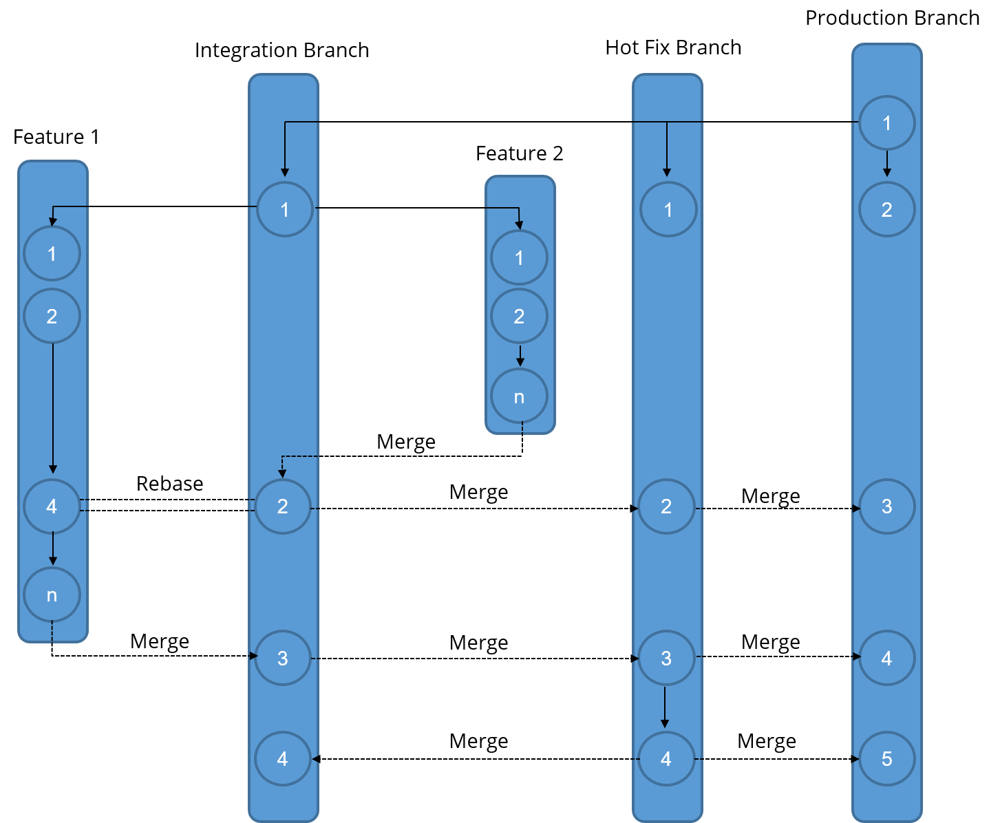

<br/>

## **You must use the following:**
Git: To build the branching model.

<br/>

# Steps to perform:
## Summary
- Start with the Production branch (master branch), and then create a HotFix and Integration branch.
- Subsequently, create Feature 1 and 2 branches that integrate to the Integration branch as shown in the above figure.
- Commit some changes in the Feature 2 branch and merge it into the Integration branch. Delete this branch once merging is complete.
- Commit some changes in the Feature 1 branch and rebase it to the Integration branch.
- Merge the Integration branch into Hotfix and Production branch to update these branches.
- Commit some changes in Feature 1 branch, and then merge it into Integration, Hotfix, and Production branch. - Delete this branch once merging is complete.
- Commit some changes in the Hotfix branch and merge it into the Production as well as the Integration branch.

## Steps in detail
# Preliminaries: install and set up Git.
1. Open a new Linux SSH terminal.
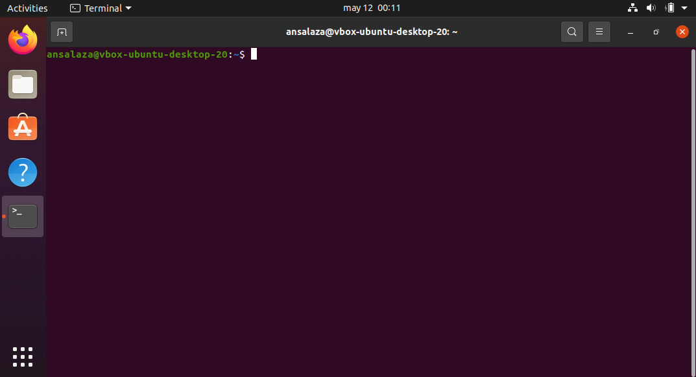

2. Ensure Git is installed.
>```
> git --version
> sudo apt-get update && sudo apt-get install git -y
> git --version
>```

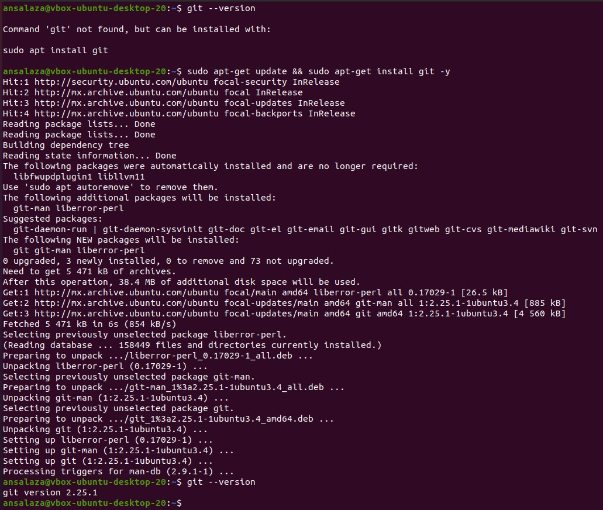

3. Create the Git repository locally.
>```
> mkdir -p ~/projects/devops/bmd
> cd ~/projects/devops/bmd
> git init
>```

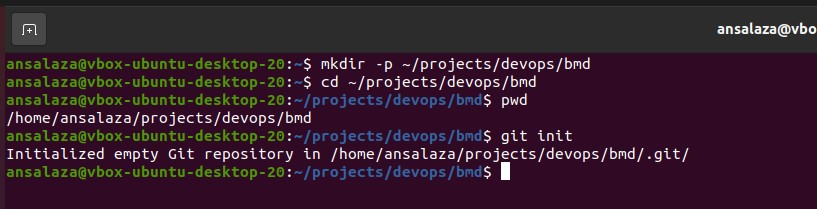


4. Configure Git locally.
>```
> git config --list
> git config --global user.name "Antonio Salazar"
> git config --global user.email "antonio.salazar@ymail.com"
> git config --global color.ui true
> git config --global core.editor vi
> git config --list
>```

- Example: 
  
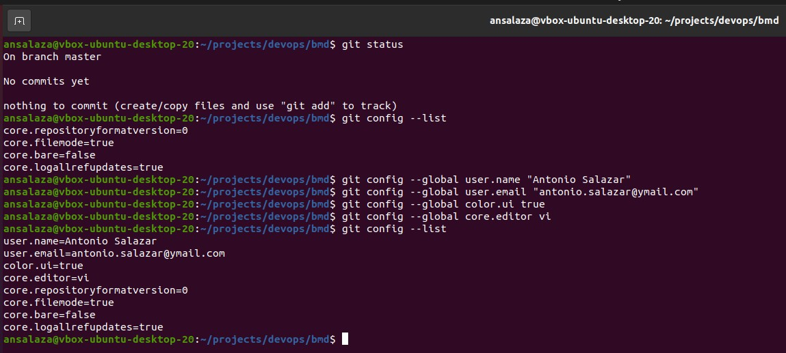

<br/>

# Start with the Production branch (master branch), and then create a HotFix and Integration branch.
- Verify whether there are anything to commit.
>```
> git status
>```

- Create the **Readme.md** the file within the initial contents.
> ```
> tee Readme.md 0<< EOF
> # Project structure
> Branches
> - Production (master)
> - HotFix
> - Integration
> - Feature1
> - Feautre2
> EOF
> ```

- Create the first commit.
>```
> git status
> git add .
> git commit -m "First commit"
> git log
>```

- Example: 
  
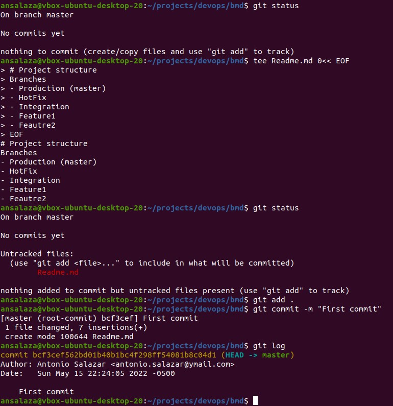

- Create the HotFix and Integration branches.
>```
> git branch HotFix
> git branch Integration
> git branch
> git checkout HotFix && ls
> git checkout Integration && ls
>```

- Example: 
  
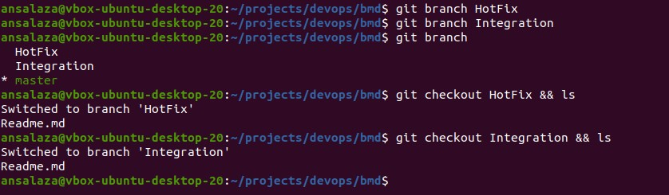

<br/>

# Subsequently, create Feature 1 and 2 branches that integrate to the Integration branch as shown in the above figure.
- Create **Feature1** and **Feature2** branches.
>```
> git branch Feature1
> git branch Feature2
> git branch
> git checkout Feature1 && ls
> git checkout Feature2 && ls
> git checkout master && ls
>```

- Exmaple:
  
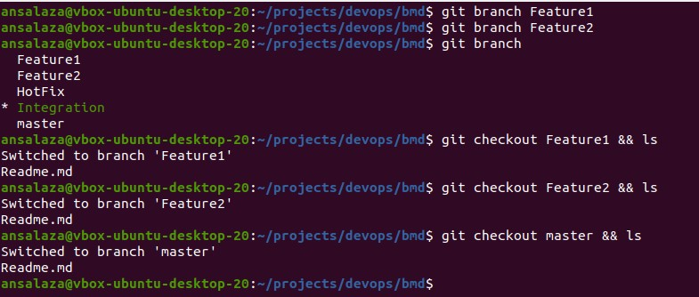

<br/>

# Commit some changes in the Feature 2 branch and merge it into the Integration branch. Delete this branch once merging is complete.
- Select the **Feature2** branch.
>```
> git checkout Feature2
>```

- Edit the **Readme.md** file. 
>```
> echo "---" >> Readme.md
> echo "Feature2: edit 1" >> Readme.md
>```

- Commit the changes just made.
>```
> git add .
> git commit -m "Feature2: edit-1 over Readme.md"
>```

- Review the changes and compare them against the original file.
>```
> git log
>```

- Create a function named **gitd** using `git diff <SHA-1> <SHA-2>` to ease commit comparisons.
>```
> gitd() {
>   first=`git log --oneline | tail -n 1 | cut -f 1 -d " "`;
>   last=`git log --oneline | head -n 1 | cut -f 1 -d " "`;
>   git diff $first $last ;
> }
>```

- Example:
  
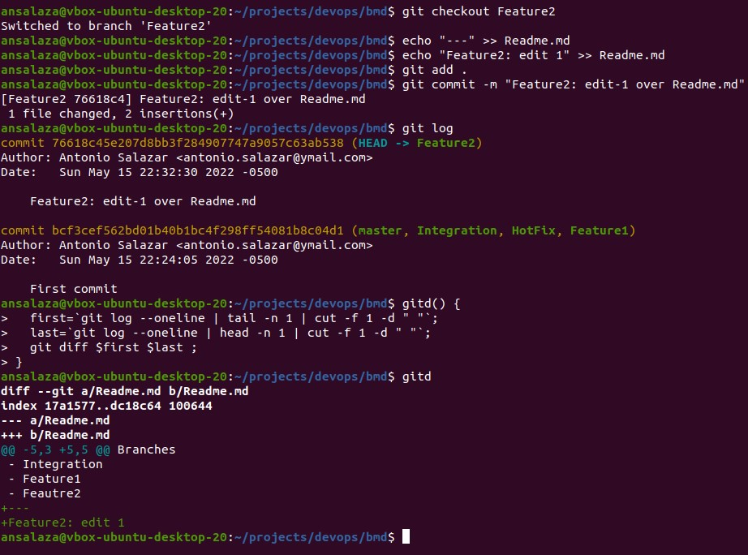

- Merge **Feature2** branch into the **Integration** one.
>```
> git checkout Integration
> git log
> git merge Feature2
> git log
>```

- Review the changes status.
>```
> git status
>```

- Delete **Feature2** branch.
>```
> git branch -d Feature2
> git log
>```

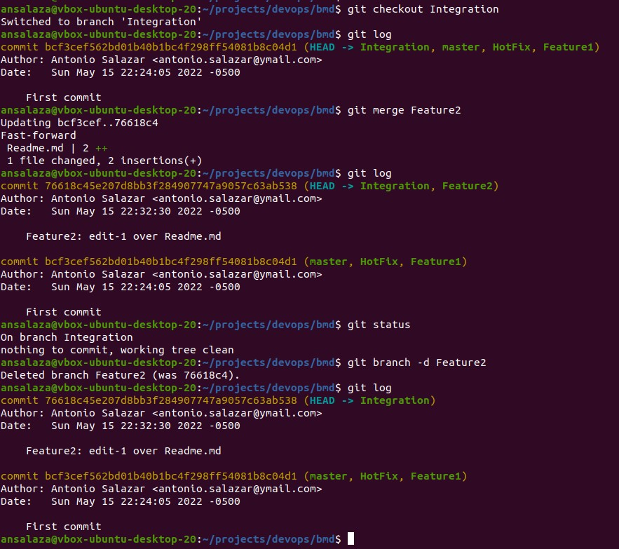

<br/>

# Commit some changes in the Feature 1 branch and rebase it to the Integration branch.
- Set **Feature1** branch to work with.
>```
> git checkout Feature1
>```

- Edit the Readme.md file. 
>```
> echo "---" >> Readme.md
> echo "Feature1: edit 1" >> Readme.md
>```

- Commit the changes just done.
>```
> git add .
> git commit -m "Feature1: edit-1 over Readme.md"  
>```

- Review the changes and compare them against the original file.
>```
> git log
> gitd # calls function declared earlier
>```

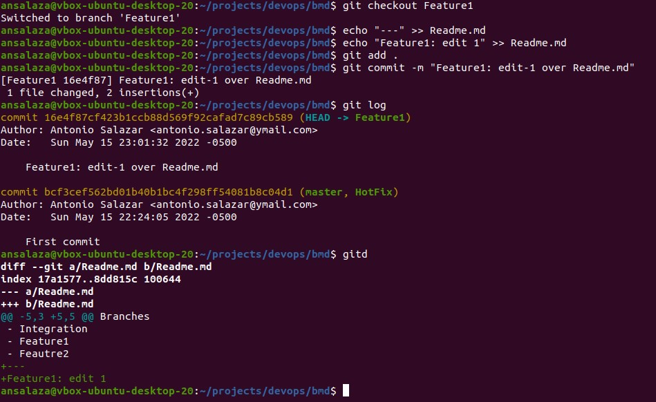

- Rebase **Feature1** to the **Integration** branch.
>```
> git rebase Integration
>```

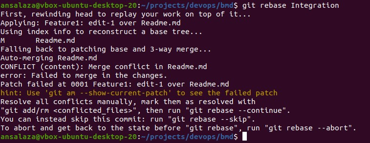


- Fix the conflict manually.
>```
> vi Readme.md
> # 1. Remove the line with '<<<<<< HEAD'
> # 2. Replace '=======' by '---'
> # 3. Delete the last line '>>>>>>> Feature1: edit-1 over Readme.md'
> # 4. Save and exit vi
>```

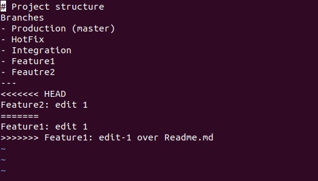

>```
> git add Readme.md
> git rebase --continue
> git status
> gitd 
>```

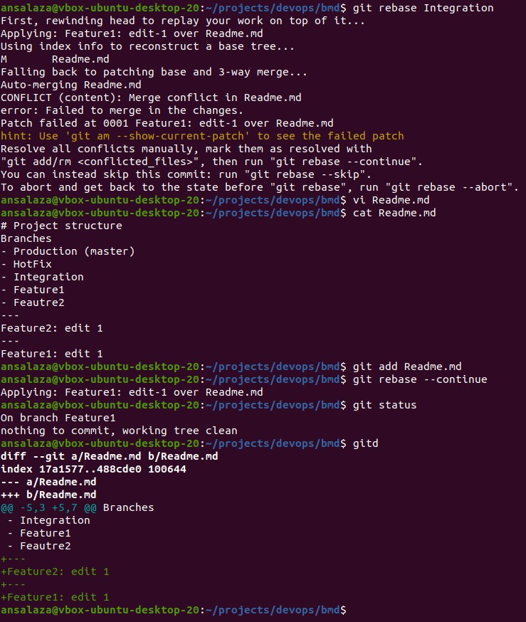

<br/>

# Merge the Integration branch into Hotfix and Production branch to update these branches.
>```
> # Integration into HotFix
> git checkout HotFix && git merge Integration && git log
> 
> # Integration into Production
> git checkout master && git merge Integration && git log
>```

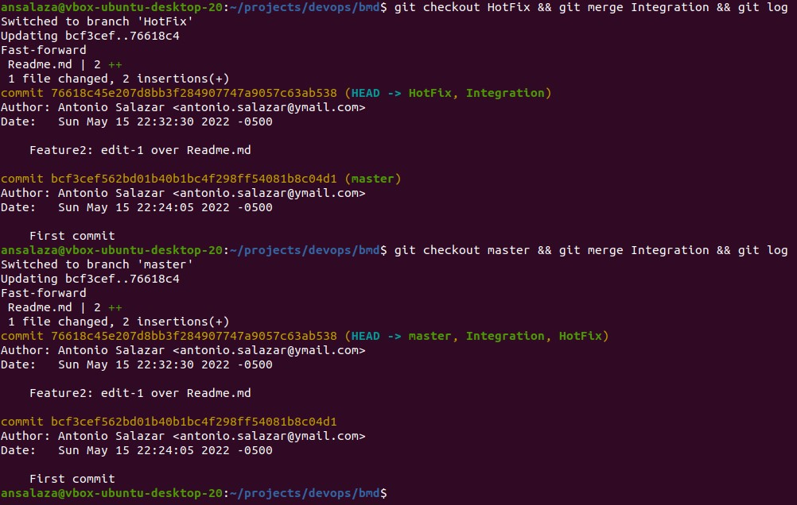

<br/>

# Commit some changes in Feature 1 branch, and then merge it into Integration, Hotfix, and Production branch. - Delete this branch once merging is complete.
- Fix the the typo 'Feautre2' originated from the beginning.
>```
> git checkout Feature1
> sed 's/Feautre2/Feature2/g' Readme.md > Readme.md.new && mv Readme.md.new Readme.md
> cat Readme.md
> git add . 
> git commit -m "Fix: replaced 'Feautre2' by 'Feature2'" 
> git log
> gitd
>```

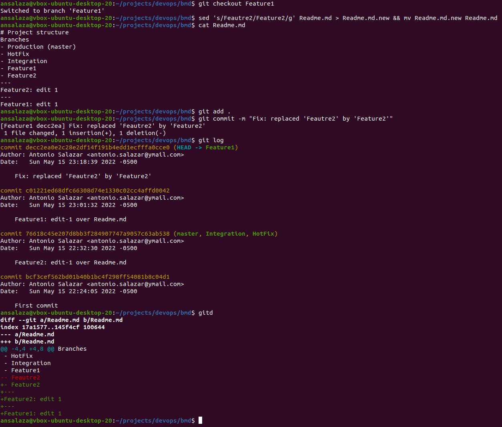

- Merge **Feature1** into **Integration**, **HotFix** and **Production** branches.
>```
> # Feature1 into Integration
> git checkout Integration && git merge Feature1 && git log --oneline
> 
> # Feature1 into HotFix
> git checkout HotFix && git merge Feature1 && git log --oneline
> 
> # Feature1 into Production
> git checkout master && git merge Feature1 && git log --oneline
>```

- Delete **Feature1** branch.
>```
> git branch -d Feature1 && git log --oneline 
>```

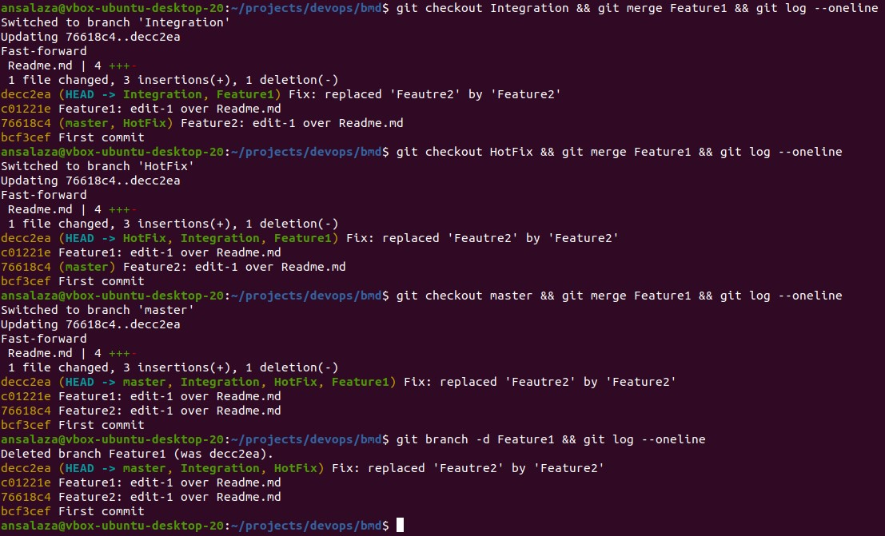

<br/>

# Commit some changes in the Hotfix branch and merge it into the Production as well as the Integration branch.
- Commit changes in HotFix branch.
>```
> git checkout HotFix
> echo "---" >> Readme.md && echo "HotFix: edit-1 on Readme.md" >> Readme.md && git status
> git add . 
> git commit -m "Hotfix: edit-1 on Readme" 
> git status 
> git log
>```

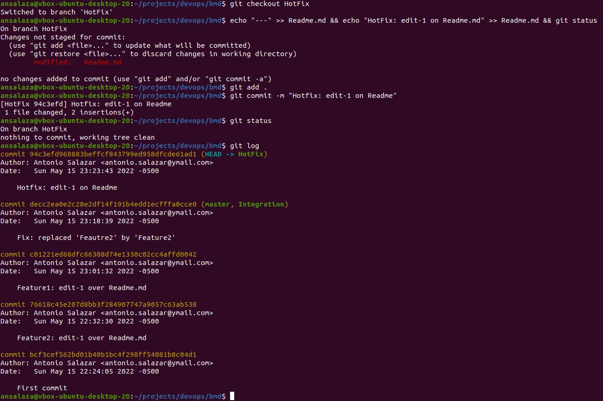

- Merge **HotFix** changes onto **Production** and **Integration** branches.
>```
> # HotFix merge into Production
> git checkout master && git merge HotFix && git log
> 
> # HotFix merge into Integration
> git checkout Integration && git merge HotFix && git log
>```

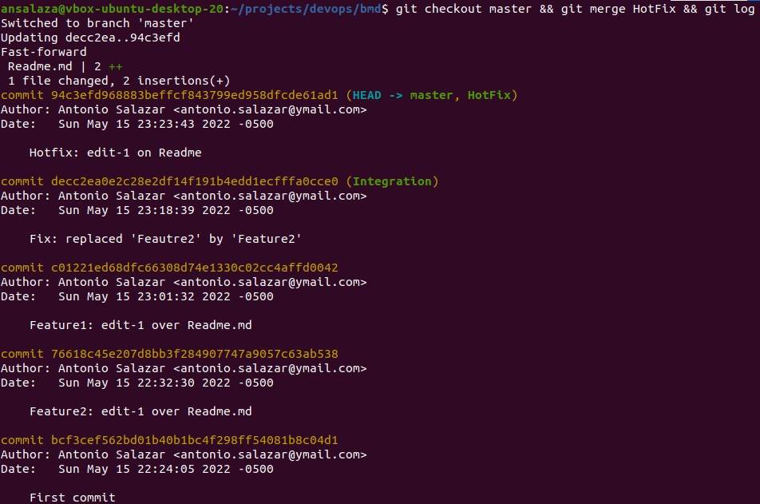

<br/>

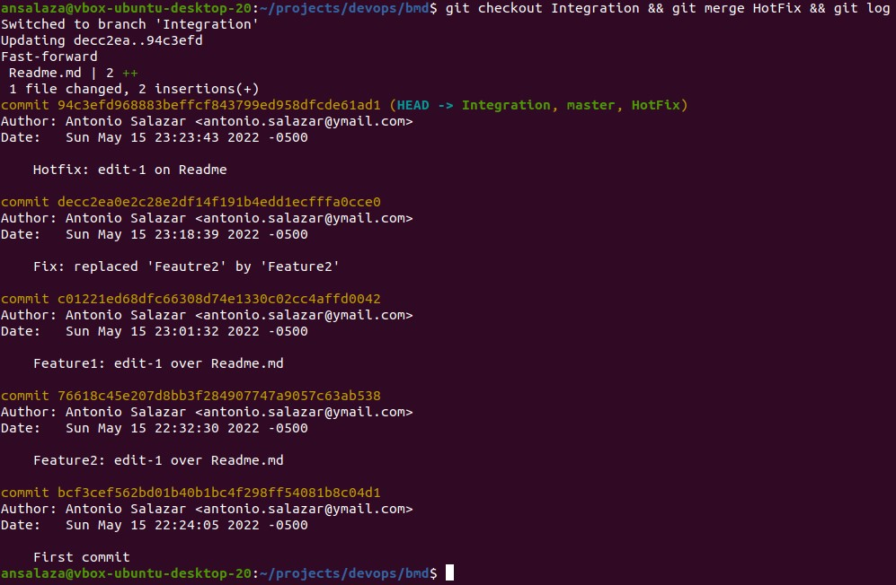

<br/>

# Log file
- [project_01_branching_model_development.log](logs/project_01_branching_model_development.log)