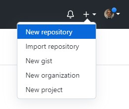
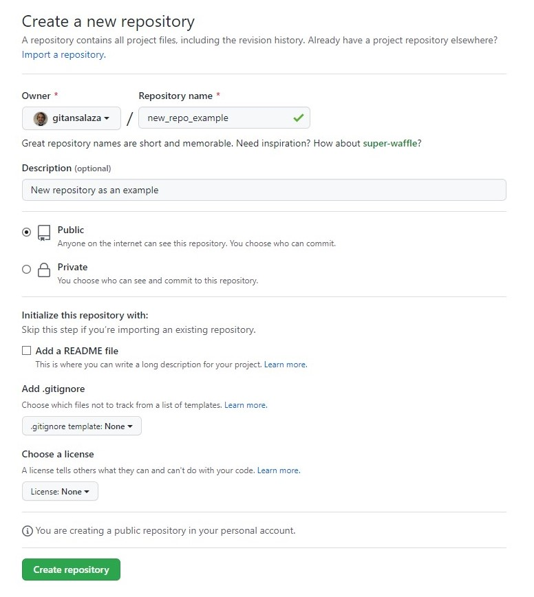
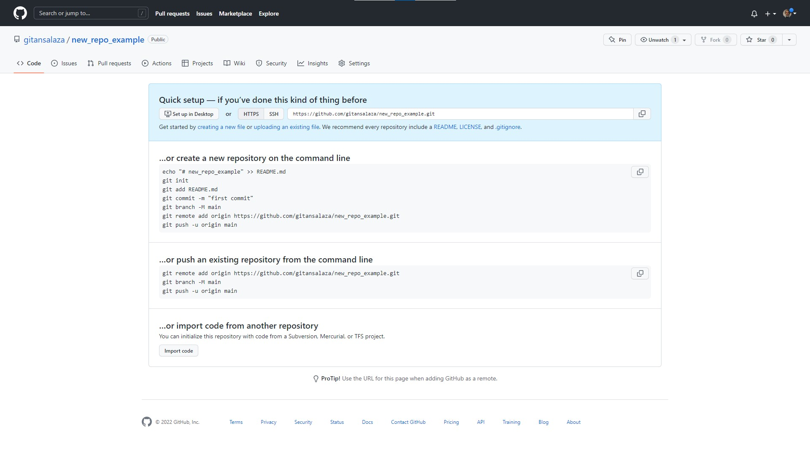

# How to create a new repository in GitHub

1. Log in to your [GitHub](https://github.com/) account, open the **+ (plus sign)** menu and select the **New repository** option.

    

2. On he Create a new repository screen:

    - Type the **Repository name**.
    - Write a short **Description** about the new repository.
    - Select the **Public** option.
    - Click on the **Create repository** button.
  
    

3. Verify the new repository details in the confirmation screen.
  
    

