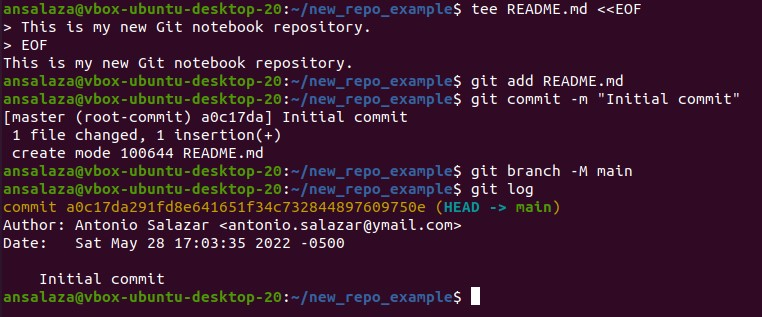

# How to create a new repository in Git

## 1. Create the repository
- Open a new terminal in your local machine.
- Create a new directory.

    >```
    > mkdir new_notebook
    >```

- Change to the new directory.

    >```
    > cd new_notebook
    >```

- Initialize the git repository.

    >```
    > git init
    >```

- Example:

    


<br/>

## 2. Set up some basic parameters
Decide the scope of the configuration parameters, could be any of system, global or local.
- Set up the username. 

    >```
    > git config --global user.name "Antonio Salazar"
    >```

- Set the email address.

    >```
    > git config --global user.email "antonio.salazar@ymail.com"
    >```

- You may set the default editor.

    >```
    > git config --global core.editor vi
    >```

- It is a good option to set the ui.color parameter.

    >```
    > git config --global color.ui true
    >```

- Verify the configuration parameters.

    >```
    > git config --list
    >```

- Example:

    

<br/>

## 3. Create a README.md file in the new repository 
- Create a new README.md file within some comments describing about the repository.

    >```
    > tee README.md <<EOF
    > This is my new Git notebook repository.
    > EOF
    >```


- Add the new README.md file to the Git staging area (tracking tree step 1).

    >```
    > git add README.md
    >```

- Issue a new commit.

    >```
    > git commit -m "Initial commit"
    >```

- Rename the master branch to main.

    >```
    > git branch -M main
    >```

- Verify the log.

    >```
    > git log
    >```

- Example:

    


