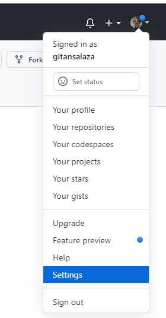
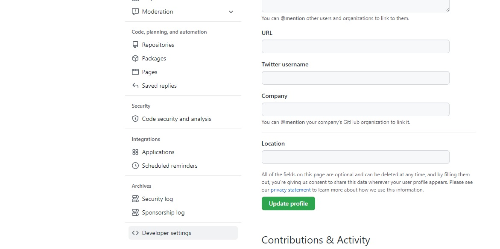
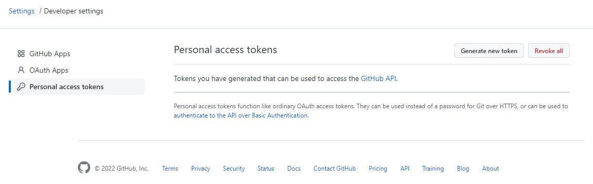
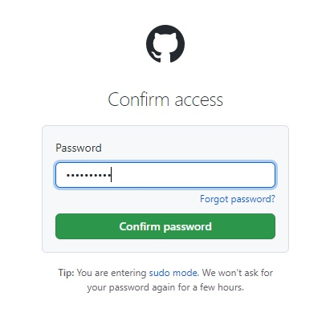
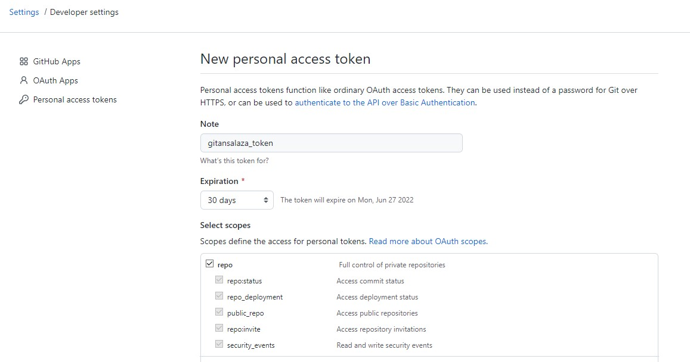
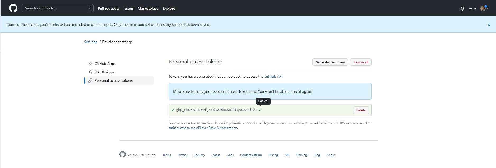

# How to create a new token in GitHub

GitHub has increased the security by allowing to use different security authentication strategies.

A simple approach option is using **Personal access tokens**.

When connecting from a local repository to a remote one, the **Personal access token** could be used as authenticattion method.

# Steps
1. Log in to your [GitHub](https://github.com/) repository, open the main menu and select **Settings** option.

    

2. Scroll down and click on the **\<> Developer settings** menu option.

    

3. Select the **Personal access token** and click on the **Generate new token** button.

    

4. Input your credentials when prompted.

    

5. Set up the token options:
    - Identify your token by commenting in the **Note** textbox.
    - Select a suitable **Expiration** due date in days.
    - Check the **repo** option.
    
    

    - Scroll down and click on the **Generate token** button.
    
    

6. As soon as the new token is displayed, click on the **copy** button and **save** your token.

    

The token creation is complete now.

You may use it when pushing from your local repository to your remote one.
