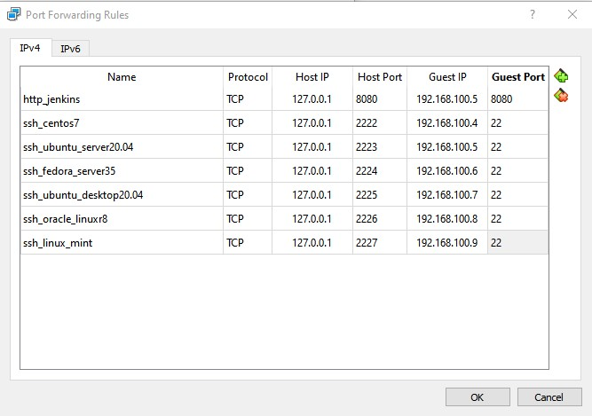

# Project 1: CI/CD Deployment Using Ansible CM Tool 

Caltech | _Center for Technology & Management Education_ | Simpl¡Learn <br/>
Post Graduate Program in DevOps <br/>
PG DO - Configuration Management with Ansible and Terraform <br/>

- Assigned to: Antonio Salazar Gomez ([antonio.salazar@ymail.com](mailto:antonio.salazar@ymail.com))
- Updated on:  2022-04-02 
- Github repo: [gitansalaza/devops](https://github.com/gitansalaza/devops/blob/main/project_01_ci-cd_deployment_using_ansible_cm_tool.md)


# DESCRIPTION

You are a DevOps engineer at XYZ Ltd. Your company is working on a Java application and wants to automate WAR file artifact deployment so that they don’t have to perform WAR deployment on Tomcat/Jetty web containers. Automate Ansible integration with Jenkins CI server so that we can run and execute playbooks to deploy custom WAR files to a web container and then perform restart for the web container.

# Steps to perform 
## Summary

- Configure Jenkins server as Ansible provisioning machine.
- Install Ansible plugins in Jenkins CI server.
- Prepare Ansible playbook to run Maven build on Jenkins CI server.
- Prepare Ansible playbook to execute deployment steps on the remote web container with restart of the web container post deployment.

 
# Execution log
- ## Configure Jenkins server as Ansible provisioning machine in Ubuntu Server 20.04

1. Check ***Java*** is installed on the Jenkins host, if it is not present, install it.
    >```
    > # Verify Java is installed
    > java -version
    > 
    > # Install OpenJdk-8 [Ubuntu]
    > sudo apt-get install openjdk-8-jdk
    > sudo apt-get install openjdk-8-jre
    >```

    Log files:
   - [01 How to install OpenJDK 8 on Ubuntu Server 20.04.3](https://youtu.be/VsXFn_YTGlo)
   - [Terminal log file](logs/01_openjdk8_installation_vbox-ubuntu-min.txt)

<br/>

2.  Verify whether ***Git*** is installed, in case it is not, then proceed to install it.
    >```
    > # Verify Git is Installed
    > git --version
    >
    > # Install Git 
    > sudo apt-get update
    > sudo apt install git-all
    >```

    Log files:
    - [02 How to install Git on Ubuntu Server 20.04.3](https://youtu.be/gcKAxupni14)   
    - [Terminal log file](logs/02_git_installation_vbox-ubuntu-min.txt)


3. In case ***Maven*** is not installed in your system, you can install it using the commands:
    >```
    > # Verify Apache Maven is installed
    > mvn -v
    > 
    > # Install Apache Maven 
    > sudo apt-get update
    > sudo apt-get install maven
    >```

    Log files:
      - [03 How to install Maven on Ubuntu Server 20.04.3](https://youtu.be/ujtrG0llCHQ)
      - [Maven installation log file](logs/03_maven_installation_vbox-ubuntu-min.txt)

4. If ***Jenkins*** is not installed in your host, install it using the commands below:

    4.1 Verify whether Jenkins is installed
    >```
    > # 1. Verify whether Jenkins is installed
    > ls -l /usr/share/jenkins
    > ```

    4.2 Download the Jenkins GPG Key 
    > ```
    > wget -q -O - https://pkg.jenkins.io/debian-stable/jenkins.io.key | sudo apt-key add -
    > ```

    4.3 Install the Debian package repository address to the server's source list 
    > ```
    > sudo sh -c 'echo deb http://pkg.jenkins.io/debian-stable binary/ > /etc/apt/sources.list.d/jenkins.list'
    > ```

    4.4 Install Jenkins  
    > ```
    > sudo apt update
    > sudo apt install jenkins
    > ```

    4.5 Start Jenkins Service 
    > ```
    > sudo systemctl start jenkins
    > ```

    4.6 Verify Jenkins service has been started 
    > ```
    > systemctl status jenkins
    > ```

    4.7 Enable Jenkins on system boot 
    > ```
    > sudo systemctl enable jenkins
    > ```

    4.8 If the firewall is inactive, the command below enables it keeping OpnSSH port open 
    > ```
    > sudo ufw allow OpenSSH
    > sudo ufw enable
    > ```

    4.9 Open port 8080, used by Jenkins
    >```
    > sudo ufw allow 8080
    >```
    
    Log files:
      - [04 How to install Jenkins Ubuntu Server 20.04.3](https://youtu.be/MnAa2xmHyKA)
      - [Jenkins installation log file](logs/04_jenkins_installation_vbox-ubuntu-min.txt)

5. Ensure ***Node.js*** and ***npm*** are installed on the host, you can install it by using the commands:

    5.1  For *Node.js* installation
    >```
    > # Verify Node.js is installed
    > node -v  # or node --version
    >
    > # Install Node.js
    > sudo apt-get update
    > sudo apt-get install nodejs
    >```

    Log files:
      - [05 How to install Node.js on Ubuntu Server 20.04.3](https://youtu.be/Yk6BO_oJ-5g)
      - [Node.js installation log](logs/06_npm_installation_vbox-ubuntu-min.txt)
    
    5.2 For *npm* installation
    >```
    > # Check npm is installed
    > npm --version
    >
    > # Install npm
    > sudo apt-get update
    > sudo apt-get install npm
    >```

    Log files:
      - [06 How to install npm on Ubuntu Server 20.04.3](https://youtu.be/UqO08tf-9ZE)
      - [npm installation log](logs/06_npm_installation_vbox-ubuntu-min.txt)

6. Install Ansible

    > ```
    > # Verify Ansible is installed
    > ansible --version
    >
    > # Install Ansible
    > sudo apt install ansible
    > ```

    Log files:
       - [07 How to install Ansible on Ubuntu Server 20.04.3](https://youtu.be/33TpTCP7ccs)
       - [Terminal log about Ansible installation](logs/07_ansible_installation_vbox-ubuntu-min.txt)
  
- ## Install Ansible plugins in Jenkins CI server
1. Open you Jenkins instance [http://localhost:8080](http://localhost:8080)
2. Login with the ***Admin*** user credentials.
3. Go to ***Manage Jenkins > Plugins*** menu.
4. Click on the ***Available*** tab and search for *ansible*.
5. Hit the ***Install without restart*** button.

    Log files:
       - [08 How to install Ansible plugin on Jenkins 2.332.2](https://youtu.be/FYuV2gKSvBk)
       - [Terminal log about Ansible installation](logs/07_ansible_installation_vbox-ubuntu-min.txt)
        
- ## Create a virtual network having at least one master server and a couple of slaves
Using any Virtualization tool, create some Virtual Machines with the OS of your preference.
_The Virtual Machines were created with VirtualBox, and the operating systems are described below:_

| Machine Role | Operating System | VM IP Address | VM Port | Host IP Address  | Host port | Function |
| -- | -- | -- | -- | --  | -- | -- |
| Master | Ubuntu Server 20.04.3 | 192.168.100.5 | 2223 | 127.0.0.1  | 22 | ssh |
| Master | Ubuntu Server 20.04.3 | 192.168.100.5 | 8080 | 127.0.0.1  | 8080 | http_jenkins |
| Remote | CentOs Server 7 | 192.168.100.4 | 2222 | 127.0.0.1  | 22 | ssh |
| Remote | CentOs Server 7 | 192.168.100.4 | 8080 | 127.0.0.1  | 8088 | http_tomcat |
| Remote | Fedora Server 35 | 192.168.100.6 | 2222 | 127.0.0.1  | 22 | ssh |

i.e.



- ## Configure Ansible Inventory, Master and Slave Hosts Connection
1. Create a new user
    >```
    > NEW_USER=devops
    > sudo useradd -m -s /bin/bash $NEW_USER
    > sudo passwd $NEW_USER
    >
    > # Grant sudo rights to the new user
    > sudo usermod -aG sudo $NEW_USER
    > 
    > sudo su - $NEW_USER
    >```

2. Create the SSH keys for your host
    >```
    > ssh-keygen -t rsa 
    >
    > # Hit ENTER to accept the default options
    > # input the passphrase if needed
    >```

3. Copy the ssh key to the destination hosts
    >```
    > # Repeat this step for each slave machine
    > ssh-copy-id 192.168.100.4 ;
    >
    > # Notice the IP address could change depending on the network
    >```

4. Configure the Ansible Inventory 
    >```
    > sudo vi /etc/ansible/hosts
    >
    > # Input the host list, i.e.
    > [webserver]
    > 192.168.100.4
    >
    > [dbserver]
    > 192.168.100.6
    >```

5. Test the connection 
    >```
    > ansible all -m ping
    > ansible all -m command -a 'uptime'
    >```


    Log files:
      - [09 How to configure Ansible Inventory, Master and Slave hosts connection](https://youtu.be/Uiv190CaRO8)
      - [Ansible configuration log](logs/09_ansible_configuration_vbox-ubuntu-min.txt)

<br/>

- ## Prepare Ansible playbook to run Maven build on Jenkins CI server
- ## Prepare Ansible playbook to execute deployment steps on the remote web container with restart of the web container post deployment

    In this section, there were two main tasks:
    - Install and setup Apache Tomcat in the Web Server
    - Integrate Ansible and Maven with Jenkins jobs and pipe lines.

    The videos and scripts followd in the next section describe in detail how the integration was accomplished.

 <br />

# Videos
- [01 How to install OpenJDK 8 on Ubuntu Server 20.04.3](https://youtu.be/VsXFn_YTGlo)
- [02 How to install Git on Ubuntu Server 20.04.3](https://youtu.be/gcKAxupni14)
- [03 How to install Maven on Ubuntu Server 20.04.3](https://youtu.be/ujtrG0llCHQ)
- [04 How to install Jenkins Ubuntu Server 20.04.3](https://youtu.be/MnAa2xmHyKA)
- [05 How to install Node.js on Ubuntu Server 20.04.3](https://youtu.be/Yk6BO_oJ-5g)
- [06 How to install npm on Ubuntu Server 20.04.3](https://youtu.be/UqO08tf-9ZE)
- [07 How to install Ansible on Ubuntu Server 20.04.3](https://youtu.be/33TpTCP7ccs)
- [08 How to install Ansible plugin on Jenkins 2.332.2](https://youtu.be/FYuV2gKSvBk)
- [09 How to configure Ansible Inventory, Master and Slave hosts connection](https://youtu.be/Uiv190CaRO8)
- [10 How to manage Apache Tomcat Service from an Ansible playbook executed by a Jenkins pipeline](https://youtu.be/UCp1_puQVBY)
- [11 How to Integrate Maven with Jenkins to deploy WAR/WEAR applications](https://youtu.be/HXBHRBTaX54)
- [12 Example about a Jenkins build to Deploy an application to Apache Tomcat](https://youtu.be/zp0AiQKyjd4)
- [Adding SSH credentials on Jenkins](https://youtu.be/xOBm-wrCCXo)
- [Creating a new view on Jenkins](https://youtu.be/Xy3bJDiCjOk)
- [Running a playbook test on Jenkins](https://youtu.be/BQ8MoWxtFiM)

<br/>

# Scripts
- [Install Apache Tomcat playbook](scripts/install_apache_tomcat.yaml)
- [Manage Apache tomcat Service](scripts/apache_tomcat_service.yaml)
- [Manage Apache tomcat Service Piepeline](scrits/apache_tomcat_service_pipeline.txt)
- [Deploy sample app](scripts/deploy_sample_war.yaml)
- [Deploy sample app pipeline](scripts/deploy_pipeline.txt)


# References
- [How To Install Jenkins on Ubuntu 20.04](https://www.digitalocean.com/community/tutorials/how-to-install-jenkins-on-ubuntu-20-04)
